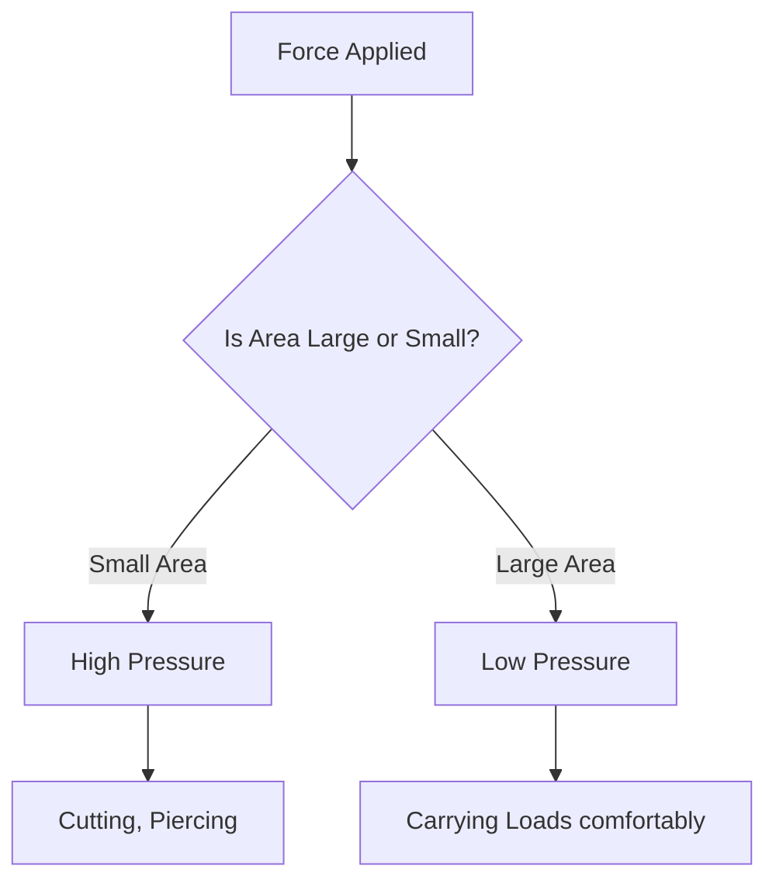
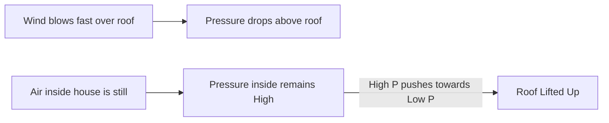
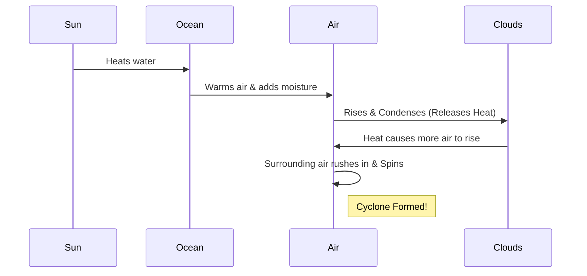

<<<FILE_START: index.mdx>>>
---
title: "Pressure, Winds, Storms, and Cyclones"
description: "Understanding the relationship between Force and Pressure, and how air pressure drives weather phenomena like storms and cyclones."
date: 2025-01-15
tags: ["physics", "pressure", "weather", "grade-8"]
order: 1
draft: false
---

import Callout from '@/components/Callout.astro'

## Introduction

Have you ever wondered why school bags have wide straps? Or why a sharp knife cuts better than a blunt one? Or what invisible force crushes a plastic bottle when you suck the air out of it?

The answer to all these questions lies in a single concept: **Pressure**.

In this chapter, we will explore:
1.  **Pressure:** How force is distributed over an area.
2.  **Fluids:** How liquids and gases (like air) exert pressure.
3.  **Weather:** How differences in air pressure create winds, storms, and powerful cyclones.

### Chapter Roadmap

*   **Topic 1:** [Understanding Pressure](/topics/01-pressure) (Solids)
*   **Topic 2:** [Liquid and Atmospheric Pressure](/topics/02-fluid-pressure) (Fluids)
*   **Topic 3:** [Wind and Air Pressure](/topics/03-wind-and-pressure) (High Speed Winds)
*   **Topic 4:** [Storms and Cyclones](/topics/04-storms-and-cyclones) (Thunderstorms, Lightning, Cyclones)

### Formula Sheet

| Quantity | Symbol | Formula | SI Unit |
| :--- | :--- | :--- | :--- |
| **Pressure** | $P$ | $$P = \frac{F}{A}$$ | Pascal ($Pa$) or $N/m^2$ |
| **Force** | $F$ | $$F = P \times A$$ | Newton ($N$) |
| **Area** | $A$ | $$A = \frac{F}{P}$$ | Square Meter ($m^2$) |

<Callout variant="tip">
**Key Relationship:** Pressure is **inversely proportional** to Area.
*   Smaller Area $\rightarrow$ Higher Pressure (e.g., Needle tip).
*   Larger Area $\rightarrow$ Lower Pressure (e.g., Wide bag straps).
</Callout>

<<<FILE_END>>>
<<<FILE_START: topics/01-pressure.mdx>>>
---
title: "What is Pressure?"
description: "Defining pressure as Force per unit Area and exploring real-life examples."
date: 2025-01-15
tags: ["pressure", "force", "area"]
order: 1
draft: false
---

import Callout from '@/components/Callout.astro'

## The Concept of Pressure

Imagine two students, Megha and Pawan, carrying identical heavy bags. Megha is comfortable, but Pawan is in pain.
*   **Megha's Bag:** Broad straps.
*   **Pawan's Bag:** Narrow straps.

Why does the narrow strap hurt more? The **weight** (force) is the same, but the **area** of contact is different.

### Definition

**Pressure** is the force acting perpendicularly on a unit area of a surface.

$$
\text{Pressure} = \frac{\text{Force}}{\text{Area}}
$$

*   **SI Unit:** Newton per square metre ($N/m^2$), also called **Pascal (Pa)**.

### Effect of Area on Pressure

Since Area is in the denominator of the formula, changing the area has the opposite effect on pressure.

1.  **Decreasing Area increases Pressure:**
    *   **Knives:** Have very sharp edges (small area) to cut easily with less force.
    *   **Nails:** Have pointed tips to drive into walls easily.

2.  **Increasing Area decreases Pressure:**
    *   **School Bags:** Wide straps spread the weight over a larger shoulder area, reducing pain.
    *   **Porters:** Place a round cloth (*pagdi*) on their heads to increase the contact area for heavy loads.
    *   **Dams:** Have broad bases to withstand high water pressure at the bottom.

### Visualizing Pressure

  <svg width="500" height="250" viewBox="0 0 500 250" xmlns="http://www.w3.org/2000/svg">
    <!-- Ground -->
    <line x1="50" y1="200" x2="450" y2="200" stroke="currentColor" stroke-width="2" />

    <!-- Scenario A: Sharp/Narrow -->
    <rect x="100" y="100" width="40" height="100" fill="#ef4444" opacity="0.8" />
    <text x="120" y="90" text-anchor="middle" fill="currentColor">Force (100N)</text>
    <line x1="120" y1="95" x2="120" y2="130" stroke="currentColor" stroke-width="2" marker-end="url(#arrow)" />
    <text x="120" y="230" text-anchor="middle" fill="currentColor">Small Area = High Pressure</text>

    <!-- Scenario B: Broad -->
    <rect x="300" y="100" width="120" height="100" fill="#3b82f6" opacity="0.8" />
    <text x="360" y="90" text-anchor="middle" fill="currentColor">Force (100N)</text>
    <line x1="360" y1="95" x2="360" y2="130" stroke="currentColor" stroke-width="2" marker-end="url(#arrow)" />
    <text x="360" y="230" text-anchor="middle" fill="currentColor">Large Area = Low Pressure</text>

    <defs>
      <marker id="arrow" markerWidth="10" markerHeight="10" refX="5" refY="5" orient="auto">
        <path d="M0,0 L10,5 L0,10" fill="currentColor" />
      </marker>
    </defs>
  </svg>

<Callout variant="info">
**Example Calculation:**
If a force of $100 \text{ N}$ acts on an area of $2 \text{ m}^2$:
$$P = \frac{100}{2} = 50 \text{ Pa}$$
If the same force acts on an area of $1 \text{ m}^2$:
$$P = \frac{100}{1} = 100 \text{ Pa}$$
**Halving the area doubles the pressure!**
</Callout>
<<<FILE_END>>>
<<<FILE_START: topics/02-fluid-pressure.mdx>>>
---
title: "Liquid and Atmospheric Pressure"
description: "How liquids exert pressure at depths and the massive weight of the atmosphere."
date: 2025-01-15
tags: ["fluids", "atmospheric-pressure", "liquids"]
order: 2
draft: false
---

import Callout from '@/components/Callout.astro'

## Pressure Exerted by Liquids

Liquids and gases are collectively called **fluids**. Unlike solids, fluids exert pressure in **all directions** (downwards, sideways, and upwards).

### Key Properties of Liquid Pressure:

1.  **Pressure increases with Depth:**
    *   The deeper you go, the more weight of water is above you.
    *   *Activity:* If you attach a balloon to the bottom of a pipe and fill it with water, the balloon bulges. If you fill it higher (more depth), the balloon bulges *more*.
2.  **Liquids exert pressure on walls:**
    *   *Activity:* A plastic bottle with holes at the bottom will shoot water out. This proves water pushes sideways against the container walls.
3.  **Pressure is equal at the same depth:**
    *   If you make holes at the *same height* all around a bottle, water spurts out the same distance from all holes.

### Why are Dam walls thicker at the bottom?
Because water pressure is highest at the bottom of the reservoir. A thick base is needed to withstand this immense horizontal pressure.

## Atmospheric Pressure

We live at the bottom of a huge ocean of air called the **Atmosphere**. Air has weight, and this weight exerts pressure on us.

*   **Atmospheric Pressure:** The pressure exerted by the air around us.
*   **Magnitude:** On an area of $15 \text{ cm} \times 15 \text{ cm}$ (roughly the size of your head), the force of air is nearly **2250 N** (equal to a mass of 225 kg).

### Why don't we get crushed?
Because the pressure *inside* our bodies (blood pressure, dissolved gases) is roughly equal to the atmospheric pressure outside. They balance each other out.

### The Rubber Sucker Experiment
When you press a rubber sucker against a wall, you force the air out from between the cup and the wall.
*   **Inside:** Vacuum (Low pressure).
*   **Outside:** Atmospheric air (High pressure).
*   **Result:** The atmosphere pushes the sucker firmly against the wall, making it stick.

<<<FILE_END>>>
<<<FILE_START: topics/03-wind-and-pressure.mdx>>>
---
title: "Wind and Air Pressure"
description: "How pressure differences create wind and the effect of wind speed on pressure."
date: 2025-01-15
tags: ["wind", "bernoulli", "air-pressure"]
order: 3
draft: false
---

import Callout from '@/components/Callout.astro'

## How Wind is Formed

Air always moves from a region of **High Pressure** to a region of **Low Pressure**. This moving air is called **Wind**.

### The Mechanism
1.  **Uneven Heating:** The Sun heats the Earth unevenly (e.g., Equator gets hotter than Poles; Land heats faster than Sea).
2.  **Warm Air Rises:** When air heats up, it expands, becomes lighter, and rises.
3.  **Low Pressure Created:** The rising warm air leaves behind a gap (Low Pressure area).
4.  **Cool Air Rushes In:** Cool, dense air from a surrounding High Pressure area rushes in to fill the gap.
5.  **Wind:** This movement is what we feel as wind.

## High-Speed Winds and Reduced Pressure

There is a fascinating rule in physics (related to Bernoulli's principle):
> **High-speed winds are accompanied by reduced air pressure.**

### Activity: Blowing between Balloons
If you hang two balloons close together and blow air forcefully *between* them, they move **towards** each other.
*   **Why?** Blowing increases air speed between them $\rightarrow$ Pressure decreases between them.
*   The higher pressure *outside* the balloons pushes them inwards.

### Blowing Off Roofs
During a storm, high-speed winds blow *over* the roof of a house.
1.  **Above Roof:** High speed wind $\rightarrow$ Low Pressure.
2.  **Inside House:** Still air $\rightarrow$ High Pressure.
3.  **Result:** The high pressure inside pushes the roof **upwards**, blowing it away.

<Callout variant="warning">
**Safety Tip:** This is why it is sometimes safer to open windows during a tornado/cyclone—to equalize the pressure difference (though mostly you should seek shelter!).
</Callout>

<<<FILE_END>>>
<<<FILE_START: topics/04-storms-and-cyclones.mdx>>>
---
title: "Storms, Thunderstorms, and Cyclones"
description: "The formation of powerful weather events and safety measures."
date: 2025-01-15
tags: ["cyclone", "thunderstorm", "lightning", "safety"]
order: 4
draft: false
---

import Callout from '@/components/Callout.astro'

## Thunderstorms and Lightning

Thunderstorms develop in hot, humid tropical areas like India.
1.  **Rising Air:** Intense heat creates strong upward rising winds.
2.  **Condensation:** These winds carry water droplets upwards, where they freeze and fall again.
3.  **Static Charge:** The swift movement of falling water droplets and rising air creates friction, generating **electric charges**.
    *   Top of cloud: Positive (+)
    *   Bottom of cloud: Negative (-)
4.  **Lightning:** When charges build up heavily, they discharge through the air as a bright flash (lightning) and sound (thunder).

<Callout variant="error">
**Lightning Safety:**
*   Do NOT stand under a lone tree.
*   If in a forest, stay under small trees.
*   If in an open field, crouch low (do not lie flat).
*   Avoid umbrellas with metal rods.
</Callout>

## Cyclones

A cyclone is a huge, spinning storm formed over warm oceans.

### Formation Process
1.  **Warm Ocean:** Water must be warm (provides moisture and heat).
2.  **Rising Air:** Warm, moist air rises, creating a Low Pressure zone.
3.  **Condensation:** Water vapour condenses into rain clouds. This releases **Latent Heat**.
4.  **Fuel:** This heat warms the air further, causing it to rise faster. More air rushes in.
5.  **Spin:** Due to Earth's rotation, the rushing air starts spiraling.
6.  **The Eye:** The calm center of the storm is the "Eye". Around it are violent winds and heavy rain.

### Destruction
*   **Strong Winds:** Destroy houses, trees, power lines.
*   **Storm Surge:** The low pressure lifts the sea level, pushing a wall of water inland (flooding).
*   **Heavy Rain:** Causes floods.

### Safety Measures
*   Listen to weather warnings (IMD).
*   Move to cyclone shelters.
*   Keep an emergency kit ready.
*   Do not venture into the sea.

<<<FILE_END>>>
<<<FILE_START: solutions/intro-questions.mdx>>>
---
title: "Probe and Ponder Solutions"
description: "Answers to the introductory questions found on Page 1."
date: 2025-01-15
tags: ["solutions", "intro"]
order: 1
draft: false
---

import Callout from '@/components/Callout.astro'

## Page 1 Questions

**Q1: Why are winds stronger on some days than on others?**
**Answer:** Wind speed depends on the **pressure difference** between two regions. If the difference between the High Pressure and Low Pressure areas is very large, the air rushes faster to fill the gap, resulting in stronger winds.

**Q2: Why are water tanks usually placed at a height?**
**Answer:** Liquid pressure depends on the **height of the water column** (depth). Placing the tank high on a roof increases the vertical distance (height) between the tank and the taps on the ground floor. This creates higher pressure, ensuring a strong flow of water.

**Q3: Can air pressure really crush us?**
**Answer:** Theoretically, the weight of the atmosphere is massive (like carrying a car on your head!). However, it doesn't crush us because our bodies contain fluids and air that exert an **internal pressure** equal to the atmospheric pressure, balancing the forces.

**Q4: If the Earth stopped rotating, would cyclones still form?**
**Answer:** Likely not in the same way. The spinning motion of a cyclone is driven by the **Coriolis effect**, which is caused by the Earth's rotation. Without rotation, air would rush directly into low-pressure areas without spiraling, preventing the formation of the characteristic cyclone vortex.

<<<FILE_END>>>
<<<FILE_START: solutions/exercises.mdx>>>
---
title: "Chapter Exercises Solutions"
description: "Detailed solutions for the exercises on pages 15-18."
date: 2025-01-15
tags: ["solutions", "exercises", "grade-8"]
order: 2
draft: false
---

import Callout from '@/components/Callout.astro'

## Questions and Answers

### 1. Choose the correct statement

**(i) Water Level in Vessels (Fig 6.21):**
*   **Observation:** Three connected vessels of different shapes ($P, Q, R$).
*   **Principle:** Liquids seek their own level. Pressure at the bottom depends only on height, not shape.
*   **Answer:** (d) equal in all three vessels.

**(ii) Rubber Sucker on Smooth vs. Rough Surface:**
*   **Concept:** Suckers work because a vacuum is created, and atmospheric pressure holds them. On a rough surface, air leaks in through gaps, breaking the vacuum.
*   **Answer:** (c) M will stick but N will not stick.

**(iii) Water Tank Height:**
*   **Goal:** More pressure on ground floor.
*   **Relationship:** $P \propto Height$.
*   **Answer:** (a) increase the height ‘H’ at which the tank is placed.

**(iv) Pressure and Force in Vessels A and B:**
*   **Setup:** Both have same water level (Height $h$). A is narrow, B is wide.
*   **Pressure ($P$):** Depends only on $h$. So $P_A = P_B$.
*   **Force ($F$):** $F = P \times Area$. Since Area of B > Area of A, then $F_B > F_A$.
*   **Answer:** (b) $P_A = P_B, F_A < F_B$.

### 2. True or False
(i) Air flows from higher pressure to lower pressure. **[True]**
(ii) Liquids exert pressure only at the bottom of a container. **[False]** (They exert pressure in all directions).
(iii) Weather is stormy at the eye of a cyclone. **[False]** (The eye is calm).
(iv) During a thunderstorm, it is safer to be in a car. **[True]** (The metal body acts as a Faraday cage, protecting inside).

### 3. Boy on Sand (Lying vs Standing)
**Question:** In which case does the boy sink more?
**Answer:** He sinks more when **standing vertically** (Fig 6.23b).
*   **Reason:** Pressure $= Force / Area$. His weight (Force) is constant. When standing, his feet have a small area. When lying, his whole body has a large area. Smaller area = Higher Pressure = More sinking.

### 4. Elephant Pressure Calculation
*   **Weight ($F$):** $20000 \text{ N}$
*   **Area of 1 foot:** $0.25 \text{ m}^2$
*   **Total Area (4 feet):** $4 \times 0.25 = 1 \text{ m}^2$
*   **Pressure ($P$):** $F/A = 20000 / 1 = \mathbf{20000 \text{ Pa}}$.

### 5. Boat Pressure Calculation
**Formula:** $P = \text{Total Weight} / \text{Area}$.

**Boat A:**
*   Weight: $5 \text{ persons} \times 700 \text{ N} = 3500 \text{ N}$.
*   Area: $7 \text{ m}^2$.
*   Pressure: $3500 / 7 = \mathbf{500 \text{ Pa}}$.

**Boat B:**
*   Weight: $3 \text{ persons} \times 700 \text{ N} = 2100 \text{ N}$.
*   Area: $3.5 \text{ m}^2$.
*   Pressure: $2100 / 3.5 = \mathbf{600 \text{ Pa}}$.

**Conclusion:** Boat B experiences more pressure (by $100 \text{ Pa}$).

### 6. Conductive Air and Lightning
**Answer:** If air were a good conductor, charges would flow continuously to the ground as they formed. There would be no massive build-up of static charge in the clouds, and therefore, **no giant lightning bolts** would occur.

### 7. Bottle and Balloons (Fig 6.24)
*   **Scenario:** Water filled to a height in a bottle with two identical balloons attached at the *same height*.
*   **Answer:** Both balloons will bulge, and they will bulge **equally**.
*   **Reason:** Liquid pressure at a given depth is equal in all directions. Since the holes are at the same level, the pressure is identical.

### 9. Sea Coast Trees (Land A or B?)
*   **Clue:** Trees are bending from Side A towards Side B. Wind blows from High Pressure to Low Pressure.
*   **Context:** Summer Afternoon.
    *   Land heats up fast $\rightarrow$ Air rises $\rightarrow$ Low Pressure on Land.
    *   Sea is cooler $\rightarrow$ High Pressure on Sea.
    *   Wind blows **Sea to Land** (Sea Breeze).
*   **Conclusion:** Wind is blowing towards the land. If trees bend towards B, the wind is coming from A. So A is the Sea, and **B is the Land**.

### 13. Holes in Banners
**Answer:** High-speed winds exert immense pressure. If a banner blocks the wind completely, this high pressure can tear it or knock it down. Holes allow the wind to pass through, reducing the air resistance and pressure on the banner, keeping it safe.

<<<FILE_END>>>
<<<FILE_START: practice/pressure-calculations.mdx>>>
---
title: "Practice: Pressure Calculations"
description: "Extra problems to master P = F/A calculations."
date: 2025-01-15
tags: ["practice", "math", "physics"]
order: 1
draft: false
---

import Callout from '@/components/Callout.astro'

## Formula Review
$$
P = \frac{F}{A}
$$

### Problem 1: The High Heels vs. Flat Shoes
A girl weighs $500 \text{ N}$.
1.  **Case A:** She wears flat shoes with a total sole area of $0.05 \text{ m}^2$.
2.  **Case B:** She wears high heels where the weight is concentrated on a heel area of just $0.001 \text{ m}^2$ (assume she stands on one heel for a moment).

**Calculate the pressure in both cases.**

Click to Reveal Solution

**Case A (Flats):**
$$P = \frac{500}{0.05} = \frac{500}{5/100} = 500 \times 20 = \mathbf{10,000 \text{ Pa}}$$

**Case B (Heels):**
$$P = \frac{500}{0.001} = \frac{500}{1/1000} = 500 \times 1000 = \mathbf{500,000 \text{ Pa}}$$

*Observation: The heels exert 50 times more pressure! This is why heels sink into grass.*

### Problem 2: The Brick
A brick has dimensions $20 \text{ cm} \times 10 \text{ cm} \times 5 \text{ cm}$ and weighs $20 \text{ N}$.
Calculate the **maximum** and **minimum** pressure it can exert on the ground.

*Hint: Max pressure occurs on the smallest area. Min pressure occurs on the largest area.*

Click to Reveal Solution

**Step 1: Calculate Areas (convert to meters!)**
*   Face 1 ($20 \times 10$): $0.2 \times 0.1 = 0.02 \text{ m}^2$
*   Face 2 ($20 \times 5$): $0.2 \times 0.05 = 0.01 \text{ m}^2$ (Smallest Area)
*   Face 3 ($10 \times 5$): $0.1 \times 0.05 = 0.005 \text{ m}^2$ ... Wait.
    *   $20 \times 10 = 200 \text{ cm}^2$
    *   $20 \times 5 = 100 \text{ cm}^2$
    *   $10 \times 5 = 50 \text{ cm}^2$ (Smallest Area is actually this one).

**Correction:**
*   Largest Area ($20 \times 10$): $0.02 \text{ m}^2$.
*   Smallest Area ($10 \times 5$): $0.005 \text{ m}^2$.

**Step 2: Calculate Pressure**
*   **Minimum Pressure** (Largest Area):
    $$P = \frac{20}{0.02} = \mathbf{1000 \text{ Pa}}$$
*   **Maximum Pressure** (Smallest Area):
    $$P = \frac{20}{0.005} = \mathbf{4000 \text{ Pa}}$$

<<<FILE_END>>>
