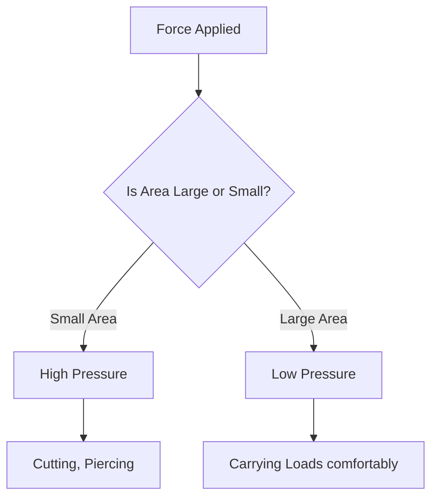

import Callout from '@/components/Callout.astro'

## Introduction

Have you ever wondered why school bags have wide straps? Or why a sharp knife cuts better than a blunt one? Or what invisible force crushes a plastic bottle when you suck the air out of it?

The answer to all these questions lies in a single concept: **Pressure**.

In this chapter, we will explore:
1.  **Pressure:** How force is distributed over an area.
2.  **Fluids:** How liquids and gases (like air) exert pressure.
3.  **Weather:** How differences in air pressure create winds, storms, and powerful cyclones.

### Chapter Roadmap

*   **Topic 1:** [Understanding Pressure](/topics/01-pressure) (Solids)
*   **Topic 2:** [Liquid and Atmospheric Pressure](/topics/02-fluid-pressure) (Fluids)
*   **Topic 3:** [Wind and Air Pressure](/topics/03-wind-and-pressure) (High Speed Winds)
*   **Topic 4:** [Storms and Cyclones](/topics/04-storms-and-cyclones) (Thunderstorms, Lightning, Cyclones)

### Formula Sheet

| Quantity | Symbol | Formula | SI Unit |
| :--- | :--- | :--- | :--- |
| **Pressure** | $P$ | $$P = \frac{F}{A}$$ | Pascal ($Pa$) or $N/m^2$ |
| **Force** | $F$ | $$F = P \times A$$ | Newton ($N$) |
| **Area** | $A$ | $$A = \frac{F}{P}$$ | Square Meter ($m^2$) |

<Callout variant="tip">
**Key Relationship:** Pressure is **inversely proportional** to Area.
*   Smaller Area $\rightarrow$ Higher Pressure (e.g., Needle tip).
*   Larger Area $\rightarrow$ Lower Pressure (e.g., Wide bag straps).
</Callout>

