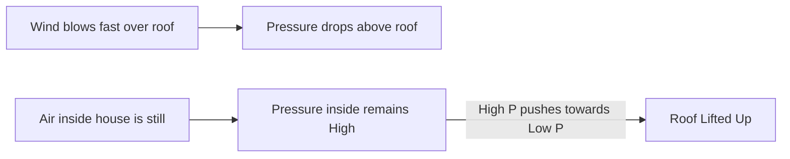

import Callout from '@/components/Callout.astro'

## How Wind is Formed

Air always moves from a region of **High Pressure** to a region of **Low Pressure**. This moving air is called **Wind**.

### The Mechanism
1.  **Uneven Heating:** The Sun heats the Earth unevenly (e.g., Equator gets hotter than Poles; Land heats faster than Sea).
2.  **Warm Air Rises:** When air heats up, it expands, becomes lighter, and rises.
3.  **Low Pressure Created:** The rising warm air leaves behind a gap (Low Pressure area).
4.  **Cool Air Rushes In:** Cool, dense air from a surrounding High Pressure area rushes in to fill the gap.
5.  **Wind:** This movement is what we feel as wind.

## High-Speed Winds and Reduced Pressure

There is a fascinating rule in physics (related to Bernoulli's principle):
> **High-speed winds are accompanied by reduced air pressure.**

### Activity: Blowing between Balloons
If you hang two balloons close together and blow air forcefully *between* them, they move **towards** each other.
*   **Why?** Blowing increases air speed between them $\rightarrow$ Pressure decreases between them.
*   The higher pressure *outside* the balloons pushes them inwards.

### Blowing Off Roofs
During a storm, high-speed winds blow *over* the roof of a house.
1.  **Above Roof:** High speed wind $\rightarrow$ Low Pressure.
2.  **Inside House:** Still air $\rightarrow$ High Pressure.
3.  **Result:** The high pressure inside pushes the roof **upwards**, blowing it away.

<Callout variant="warning">
**Safety Tip:** This is why it is sometimes safer to open windows during a tornado/cyclone—to equalize the pressure difference (though mostly you should seek shelter!).
</Callout>

