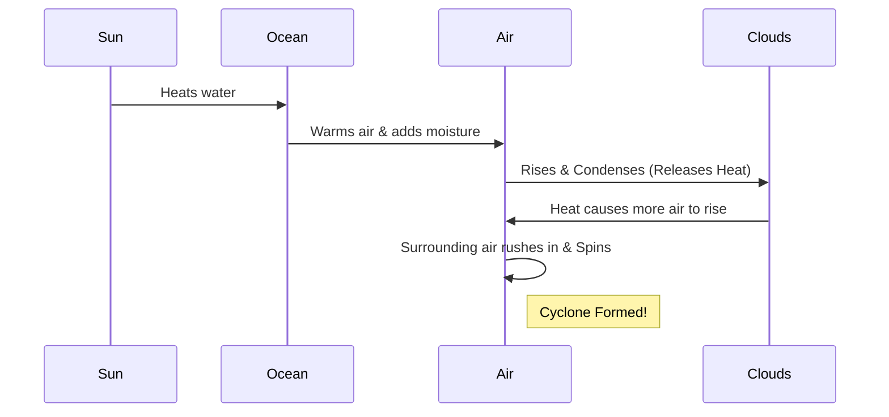

import Callout from '@/components/Callout.astro'

## Thunderstorms and Lightning

Thunderstorms develop in hot, humid tropical areas like India.
1.  **Rising Air:** Intense heat creates strong upward rising winds.
2.  **Condensation:** These winds carry water droplets upwards, where they freeze and fall again.
3.  **Static Charge:** The swift movement of falling water droplets and rising air creates friction, generating **electric charges**.
    *   Top of cloud: Positive (+)
    *   Bottom of cloud: Negative (-)
4.  **Lightning:** When charges build up heavily, they discharge through the air as a bright flash (lightning) and sound (thunder).

<Callout variant="error">
**Lightning Safety:**
*   Do NOT stand under a lone tree.
*   If in a forest, stay under small trees.
*   If in an open field, crouch low (do not lie flat).
*   Avoid umbrellas with metal rods.
</Callout>

## Cyclones

A cyclone is a huge, spinning storm formed over warm oceans.

### Formation Process
1.  **Warm Ocean:** Water must be warm (provides moisture and heat).
2.  **Rising Air:** Warm, moist air rises, creating a Low Pressure zone.
3.  **Condensation:** Water vapour condenses into rain clouds. This releases **Latent Heat**.
4.  **Fuel:** This heat warms the air further, causing it to rise faster. More air rushes in.
5.  **Spin:** Due to Earth's rotation, the rushing air starts spiraling.
6.  **The Eye:** The calm center of the storm is the "Eye". Around it are violent winds and heavy rain.

### Destruction
*   **Strong Winds:** Destroy houses, trees, power lines.
*   **Storm Surge:** The low pressure lifts the sea level, pushing a wall of water inland (flooding).
*   **Heavy Rain:** Causes floods.

### Safety Measures
*   Listen to weather warnings (IMD).
*   Move to cyclone shelters.
*   Keep an emergency kit ready.
*   Do not venture into the sea.

