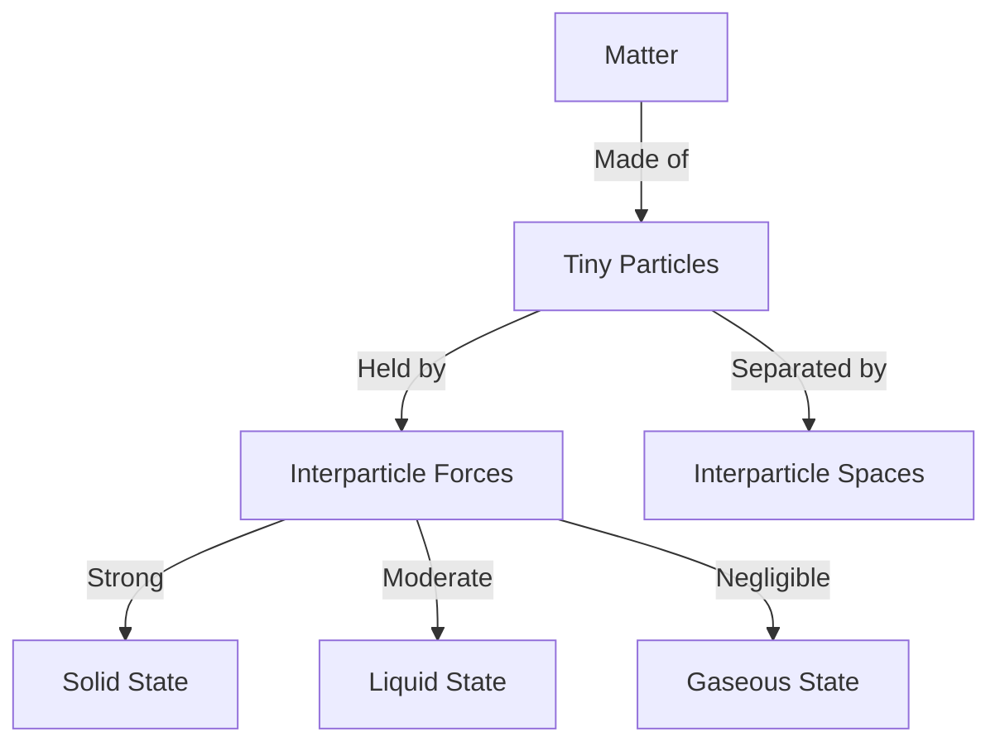

import Callout from '@/components/Callout.astro'

## Introduction

Why does sand pile up while water flows? Why can we smell incense from across the room? The answer lies in the **Particulate Nature of Matter**.

In this chapter, we discover that everything around us—rocks, water, air—is made up of extremely tiny particles. We will explore how these particles are arranged, how they move, and how forces between them determine whether something is a solid, a liquid, or a gas.

### Chapter Roadmap

*   **Topic 1:** [Composition of Matter](/topics/01-composition-of-matter) (Particles and Spaces)
*   **Topic 2:** [The Solid State](/topics/02-solid-state) (Strong attraction, fixed shape)
*   **Topic 3:** [The Liquid State](/topics/03-liquid-state) (Fixed volume, fluid shape)
*   **Topic 4:** [The Gaseous State](/topics/04-gaseous-state) (High compressibility, diffusion)
*   **Topic 5:** [Comparison of States](/topics/05-comparing-states) (Summary Table)

### Key Definitions

| Term | Definition |
| :--- | :--- |
| **Matter** | Anything that has mass and occupies space. |
| **Constituent Particles** | The basic building blocks (atoms/molecules) that make up matter. |
| **Interparticle Space** | The empty space between the particles of matter. |
| **Interparticle Attraction** | The force of attraction holding the particles together. |
| **Diffusion** | The movement of particles from an area of higher concentration to lower concentration (e.g., smell spreading). |

<Callout variant="info">
**Our Scientific Heritage:** Long before modern science, the ancient Indian philosopher **Acharya Kanad** proposed that matter is made of tiny, indivisible, eternal particles called **Parmanu** (Atom).
</Callout>

