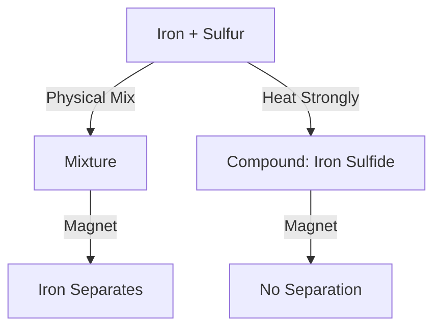

<<<FILE_START: index.mdx>>>
---
title: "Nature of Matter: Elements, Compounds, and Mixtures"
description: "Chapter 8 overview covering the classification of matter into Elements, Compounds, and Mixtures."
date: 2025-01-15
tags: ["matter", "elements", "compounds", "mixtures", "grade-8"]
order: 1
draft: false
---

import Callout from '@/components/Callout.astro'

## Introduction

Look around you. The air you breathe, the water you drink, and the food you eat are all forms of **Matter**. But are they all the same?

In this chapter, we explore how matter is classified into three main categories based on its composition: **Elements, Compounds, and Mixtures**. We will learn how to distinguish between them using scientific experiments and understand their unique properties.

### Chapter Roadmap

*   **Topic 1:** [Mixtures](/topics/01-mixtures) (Uniform vs Non-uniform, Alloys, Air)
*   **Topic 2:** [Pure Substances](/topics/02-pure-substances) (Definition of purity in science)
*   **Topic 3:** [Elements](/topics/03-elements) (Metals, Non-metals, Atoms)
*   **Topic 4:** [Compounds](/topics/04-compounds) (Formation, Properties vs Constituents)
*   **Topic 5:** [Iron & Sulfur Experiment](/topics/05-iron-sulfur-experiment) (Distinguishing Mixtures from Compounds)

### Key Definitions

| Term | Definition |
| :--- | :--- |
| **Pure Substance** | Matter made up of only one type of particle (atoms or molecules). Cannot be separated by physical methods. |
| **Mixture** | Formed when two or more substances are mixed together without any chemical reaction. Components retain their properties. |
| **Element** | A pure substance that cannot be broken down into simpler substances. Building blocks of matter (e.g., Gold, Oxygen). |
| **Compound** | A pure substance formed when two or more elements combine chemically in a fixed ratio (e.g., Water, Salt). |
| **Atom** | The smallest particle of an element. |
| **Molecule** | A group of two or more atoms held together by chemical bonds. |

```mermaid
graph TD
    Matter[Matter]
    Matter --> Pure[Pure Substances]
    Matter --> Mix[Mixtures]

    Pure --> Element[Elements]
    Pure --> Compound[Compounds]

    Mix --> Hom[Uniform (Homogeneous)]
    Mix --> Het[Non-uniform (Heterogeneous)]

    Element --> Metal[Metals]
    Element --> NonMetal[Non-metals]

    Hom --> Air[e.g., Air, Alloys]
    Het --> Soil[e.g., Soil, Salad]
```
<<<FILE_END>>>
<<<FILE_START: topics/01-mixtures.mdx>>>
---
title: "Mixtures"
description: "Understanding uniform and non-uniform mixtures with examples."
date: 2025-01-15
tags: ["mixtures", "alloys", "air"]
order: 1
draft: false
---

import Callout from '@/components/Callout.astro'

## What is a Mixture?

A **Mixture** is formed when two or more substances are combined physically.
*   **Key Feature:** The components **retain their original properties**. They do *not* react chemically.
*   **Separation:** Can usually be separated by physical methods (filtration, evaporation, magnetic separation).

### Types of Mixtures

1.  **Non-Uniform (Heterogeneous) Mixtures:**
    *   The components are visible with the naked eye.
    *   **Examples:** Sprout salad, Oil and water, Sand and iron filings.

2.  **Uniform (Homogeneous) Mixtures:**
    *   The components are evenly distributed and cannot be seen separately.
    *   **Examples:** Sugar solution, Air, Alloys.

### Special Examples of Mixtures

#### 1. Air
Air is a **uniform mixture** of gases like Nitrogen (78%), Oxygen (21%), Argon, Carbon Dioxide, and Water Vapour.
*   **Proof:** We can test for components separately (e.g., Lime water turns milky due to $CO_2$).

#### 2. Alloys
Alloys are uniform mixtures of metals (or metal and non-metal).
*   **Stainless Steel:** Iron + Nickel + Chromium + Carbon.
*   **Brass:** Copper + Zinc.
*   **Bronze:** Copper + Tin.

<Callout variant="info">
**Did you know?** Even though alloys look like a single substance, they are mixtures because their components are just mixed physically (melted together) and not chemically bonded in fixed stoichiometric ratios like compounds.
</Callout>

### Table: Types of Mixtures

| State of Components | Example |
| :--- | :--- |
| Gas + Gas | Air |
| Gas + Liquid | Soda water (CO2 in water) |
| Solid + Gas | Smoke (Carbon particles in air) |
| Liquid + Liquid | Vinegar (Acetic acid in water) |
| Solid + Liquid | Salt water |
| Solid + Solid | Alloys (Brass, Bronze) |
<<<FILE_END>>>
<<<FILE_START: topics/02-pure-substances.mdx>>>
---
title: "Pure Substances"
description: "The scientific definition of purity: Elements and Compounds."
date: 2025-01-15
tags: ["purity", "science-definition"]
order: 2
draft: false
---

import Callout from '@/components/Callout.astro'

## What does "Pure" mean?

In daily life, "Pure Milk" means milk without added water or adulterants.
In **Science**, "Pure Milk" is actually a **Mixture** (of water, fats, proteins, sugars).

**Scientific Definition:**
A **Pure Substance** is a form of matter that has **only one type of particle**.
*   It cannot be separated into other kinds of matter by physical processes.
*   It has a fixed composition and distinct properties.

### Classification

Pure substances are divided into two types:
1.  **Elements:** Made of only one type of atom (e.g., Gold, Oxygen).
2.  **Compounds:** Made of two or more types of atoms combined chemically in a fixed ratio (e.g., Water, Salt).

<Callout variant="tip">
**Thought Experiment:** If you could zoom into a glass of pure water, you would see billions of identical $H_2O$ molecules. If you zoomed into a gold ring, you would see billions of identical Gold ($Au$) atoms.
</Callout>
<<<FILE_END>>>
<<<FILE_START: topics/03-elements.mdx>>>
---
title: "Elements"
description: "The building blocks of matter: Metals, Non-metals, and Metalloids."
date: 2025-01-15
tags: ["elements", "atoms", "periodic-table"]
order: 3
draft: false
---

import Callout from '@/components/Callout.astro'

## What is an Element?

An **Element** is a pure substance that cannot be broken down into simpler substances by chemical reactions.
*   **Building Blocks:** Everything in the universe is made of elements.
*   **Atoms:** The smallest particle of an element is an **Atom**.

### Molecules of Elements
Atoms of some elements cannot exist alone. They combine with each other to form **Molecules**.
*   **Hydrogen ($H_2$):** 2 Hydrogen atoms.
*   **Oxygen ($O_2$):** 2 Oxygen atoms.

### Classification of Elements

There are 118 known elements. They are broadly classified as:

1.  **Metals:**
    *   Shiny, malleable, ductile, good conductors.
    *   **Examples:** Gold, Silver, Iron, Copper, Mercury (Liquid).
2.  **Non-Metals:**
    *   Dull, brittle, poor conductors.
    *   **Examples:** Carbon, Sulfur, Oxygen, Hydrogen, Bromine (Liquid).
3.  **Metalloids:**
    *   Properties in between metals and non-metals.
    *   **Examples:** Silicon, Boron.

<Callout variant="info">
**Electrolysis of Water:** When electricity is passed through water (with a little acid), it breaks down into two elements: **Hydrogen** and **Oxygen**. This proves water is not an element itself.
</Callout>
<<<FILE_END>>>
<<<FILE_START: topics/04-compounds.mdx>>>
---
title: "Compounds"
description: "How elements combine to form completely new substances."
date: 2025-01-15
tags: ["compounds", "chemical-reaction", "water"]
order: 4
draft: false
---

import Callout from '@/components/Callout.astro'

## What is a Compound?

A **Compound** is a pure substance formed when two or more elements combine **chemically** in a **fixed ratio**.

### Key Characteristics

1.  **Fixed Composition:** Water ($H_2O$) is always 2 Hydrogen atoms : 1 Oxygen atom. If the ratio changes, it becomes a different substance (like $H_2O_2$).
2.  **New Properties:** The properties of a compound are completely different from its constituent elements.
    *   **Hydrogen:** Explosive gas.
    *   **Oxygen:** Supports combustion (burning).
    *   **Water ($H_2O$):** Extinguishes fire!

3.  **Separation:** Constituents can only be separated by **chemical methods** (like electrolysis), not physical methods (like filtration).

### Common Examples

| Compound | Elements Present | Chemical Formula |
| :--- | :--- | :--- |
| Water | Hydrogen, Oxygen | $H_2O$ |
| Common Salt | Sodium, Chlorine | $NaCl$ |
| Sugar | Carbon, Hydrogen, Oxygen | $C_{12}H_{22}O_{11}$ |
| Carbon Dioxide | Carbon, Oxygen | $CO_2$ |

### Activity: Heating Sugar
When you heat sugar in a test tube:
1.  It turns brown, then black (chars).
2.  Water droplets appear on the sides.
3.  **Result:** Sugar decomposes into **Carbon** (black residue) and **Water**. This proves Sugar is a compound.
<<<FILE_END>>>
<<<FILE_START: topics/05-iron-sulfur-experiment.mdx>>>
---
title: "The Iron and Sulfur Experiment"
description: "A definitive experiment to distinguish between a Mixture and a Compound."
date: 2025-01-15
tags: ["experiment", "iron-sulfide", "chemistry-lab"]
order: 5
draft: false
---

import Callout from '@/components/Callout.astro'

## Mixture vs Compound: A Case Study

We take two elements: **Iron filings** (Grey, Magnetic) and **Sulfur powder** (Yellow, Non-magnetic).

### Part A: Physical Mixture (Sample A)
Mix Iron filings and Sulfur powder in a dish. Do not heat.
*   **Appearance:** Yellow powder with grey specks visible (Non-uniform).
*   **Magnet Test:** If you bring a magnet, **Iron filings are attracted** and separated. Sulfur remains.
*   **Acid Test:** Add dilute HCl. **Hydrogen gas** evolves (pop sound).
    *   *Reason:* Iron reacts with acid, Sulfur does not.
*   **Conclusion:** Components retain their properties. This is a **Mixture**.

### Part B: Chemical Compound (Sample B)
Heat the mixture strongly until it glows and turns into a black mass. Cool and grind it.
*   **Appearance:** Uniform black mass (Iron Sulfide).
*   **Magnet Test:** **No attraction**. Iron has lost its magnetic property.
*   **Acid Test:** Add dilute HCl. **Hydrogen Sulfide ($H_2S$)** gas evolves (smells like rotten eggs).
    *   *Reason:* The compound reacts to form a new gas.
*   **Conclusion:** Properties have changed completely. This is a **Compound**.

### Summary Table

| Property | Mixture (Fe + S) | Compound (FeS) |
| :--- | :--- | :--- |
| **Separation** | Possible by magnet | Not possible by magnet |
| **Properties** | Shows properties of Fe (magnetic) and S | Properties are different (non-magnetic, black) |
| **Reaction with Acid** | Hydrogen Gas ($H_2$) | Hydrogen Sulfide Gas ($H_2S$) |
| **Composition** | Any ratio | Fixed ratio |


<<<FILE_END>>>
<<<FILE_START: solutions/intro-questions.mdx>>>
---
title: "Introductory Questions Solutions"
description: "Answers to Probe and Ponder questions from Page 1."
date: 2025-01-15
tags: ["solutions", "intro"]
order: 1
draft: false
---

import Callout from '@/components/Callout.astro'

## Page 1: Probe and Ponder

**Q1: Which of the entities in the picture consist of matter, and which do not?**
*   **Matter:** Students, trees, buildings, football, books, water bottles, air, clothes. (Anything with mass and volume).
*   **Not Matter:** Sunlight, shadows, heat, thoughts, sound, gravity.

**Q2: How can elements be combined to form a compound?**
**Answer:** Elements combine to form a compound through a **chemical reaction**. This usually involves energy changes (like heating, applying electricity, or burning), where atoms of different elements bond together in a fixed ratio.

**Q3: How could the discovery of a compound that absorbs carbon dioxide from the air contribute to solving environmental challenges?**
**Answer:** Carbon dioxide ($CO_2$) is a major greenhouse gas causing global warming. If we discover or create a compound that efficiently absorbs $CO_2$ from the atmosphere (Carbon Capture technology), we could significantly reduce the greenhouse effect and combat climate change.
<<<FILE_END>>>
<<<FILE_START: solutions/exercises.mdx>>>
---
title: "Chapter Exercises Solutions"
description: "Detailed solutions for the exercises on pages 16-18."
date: 2025-01-15
tags: ["solutions", "exercises", "grade-8"]
order: 2
draft: false
---

import Callout from '@/components/Callout.astro'

## Questions and Answers

### 1. Reaction A + B -> C
**Question:** A and B cannot be broken down simpler. Which statement is correct?
*   A and B are **Elements** (since they can't be broken down).
*   C is formed from A and B chemically, so C is a **Compound**.
*   Compounds have a fixed composition.
**Answer:** (iv) **A and B are elements, C is a compound, and has a fixed composition.**

### 2. Assertion-Reason: Air is a Mixture
*   **Assertion:** Air is a mixture. (True)
*   **Reason:** A mixture is formed when two or more substances are mixed without chemical change. (True)
*   **Link:** Does the reason explain why air is a mixture? Yes, because air is formed by mixing gases without them reacting chemically.
**Answer:** (i) **Both Assertion and Reason are true and Reason is the correct explanation.**

### 3. Properties of Water vs Elements
**Statement:** Water, a compound, has different properties compared to Oxygen and Hydrogen. Justify.
**Justification:**
1.  **State:** Hydrogen and Oxygen are gases; Water is a liquid.
2.  **Combustibility:** Hydrogen burns with a pop sound (fuel). Oxygen supports burning. Water puts out fire.
3.  **Composition:** Hydrogen and Oxygen are elements. Water is a compound ($H_2O$).

### 4. Matching Examples
*   (i) Elements - water (Compound) -> Incorrect.
*   (ii) Uniform mixtures - minerals, seawater, bronze, air. -> **Correct.** (Minerals can be compounds or mixtures, but often uniform. Seawater, bronze, air are uniform).
*   (iii) Pure substances - Sugar (Compound), Iron (Element), Oxygen (Element). -> Correct.
*   (iv) Non-uniform - Air (Uniform) -> Incorrect.
**Answer:** (iii) **Pure substances— carbon dioxide, iron, oxygen, sugar.**
*(ii) is also largely correct depending on the mineral definition, but (iii) is definitively chemically correct.*

### 5. Iron Oxide and Magnesium Oxide Reactions
*   **Iron (Element)** + **Oxygen/Moisture (Mixture)** $\rightarrow$ **Rust/Iron Oxide (Compound)**.
*   **Magnesium (Element)** + **Oxygen (Element)** $\rightarrow$ **Magnesium Oxide (Compound)**.
**Justification:** Elements cannot be broken down. Compounds are formed by chemical combination. Air is a mixture of gases.

### 6. Classification Table

| **Elements** | **Compounds** | **Mixtures** |
| :--- | :--- | :--- |
| Aluminium | Carbon dioxide | Sand |
| Gold | Magnesium oxide | Seawater |
| Oxygen | Rust ($Fe_2O_3$) | Muddy water |
| Sulfur | Iron sulfide | Air |
| Nitrogen | Glucose | Fruit Juice |
| Hydrogen | Water | |
| | Sodium chloride | |
| | Baking soda | |

**Pure Substances:** All Elements + All Compounds listed above.

### 7. Heating Iron and Sulfur
*   **Substance Formed:** Iron Sulfide ($FeS$).
*   **Difference:** It is a black solid, non-magnetic, and properties are different from iron or sulfur.
*   **Equation:** Iron + Sulfur $\xrightarrow{\text{Heat}}$ Iron Sulfide.

### 8. Element AND Compound?
**Answer:** **No.**
A substance is either an Element (one type of atom) or a Compound (different atoms bonded). It cannot be both. However, both are **Pure Substances**.

### 9. Water as a Mixture?
If water were a mixture of H and O:
1.  It would be a gas (mixture of two gases).
2.  Lighting a match near "water" would cause an explosion (Hydrogen burns!).
3.  Life as we know it would not exist because liquid water is essential for biological processes.

### 10. Fig 8.24 Analysis (Gas A)
*   **Reaction:** Iron + Dilute HCl $\rightarrow$ Iron Chloride + **Hydrogen Gas**.
*   **Gas A:** Hydrogen.
*   **Word Equation:** Iron + Hydrochloric Acid $\rightarrow$ Iron Chloride + Hydrogen.

### 11. Compounds from Non-metals
1.  **Water ($H_2O$):** Drinking, Washing.
2.  **Carbon Dioxide ($CO_2$):** Photosynthesis, Fire Extinguishers, Carbonated Drinks.

### 12. Gold: Mineral and Metal?
*   **Metal:** Chemically, Gold ($Au$) is a metal (shiny, conductor).
*   **Mineral:** Geologically, it is found naturally in the earth's crust in its native form (Native Gold). Since minerals are naturally occurring solid substances, native Gold is considered a mineral.
<<<FILE_END>>>
<<<FILE_START: practice/extra-questions.mdx>>>
---
title: "Practice: Extra Questions"
description: "Additional questions to test understanding of separation and classification."
date: 2025-01-15
tags: ["practice", "separation-techniques"]
order: 1
draft: false
---

import Callout from '@/components/Callout.astro'

## 1. Separation Challenge

How would you separate the following mixtures?

| Mixture | Method | Principle |
| :--- | :--- | :--- |
| **Salt and Water** | Evaporation | Water evaporates, salt is left behind. |
| **Sand and Water** | Filtration | Sand is insoluble and stays on filter paper. |
| **Iron filings and Sand** | Magnetic Separation | Iron is magnetic, sand is not. |
| **Oil and Water** | Separating Funnel | Oil is less dense and floats on water. |

## 2. Identify the Mistake

**Student Statement:** "I made a compound by mixing salt and sugar in a bowl."
**Correction:** Salt and sugar mixed in a bowl is a **Mixture**, not a compound.
*   **Reason 1:** No chemical reaction took place (no heat/light/new substance).
*   **Reason 2:** You can still separate them (though difficult, technically possible by solubility differences in alcohol).
*   **Reason 3:** They retain their individual tastes.

## 3. Diagrams

**Draw the particle arrangement for:**
1.  **Pure Element (Helium gas):** Single atoms far apart.
2.  **Pure Compound (CO2 gas):** Molecules (1 Carbon + 2 Oxygen) far apart.
3.  **Mixture (Air):** A mix of single atoms (Argon), diatomic molecules ($N_2, O_2$), and compound molecules ($CO_2, H_2O$) floating together.

<<<FILE_END>>>
