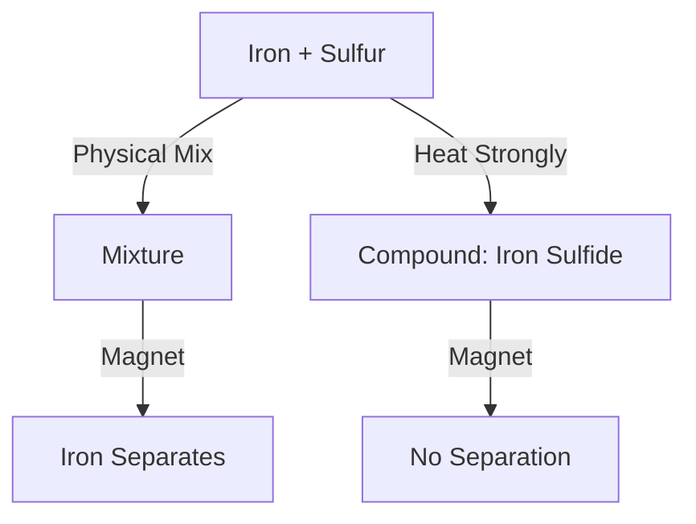

import Callout from '@/components/Callout.astro'

## Mixture vs Compound: A Case Study

We take two elements: **Iron filings** (Grey, Magnetic) and **Sulfur powder** (Yellow, Non-magnetic).

### Part A: Physical Mixture (Sample A)
Mix Iron filings and Sulfur powder in a dish. Do not heat.
*   **Appearance:** Yellow powder with grey specks visible (Non-uniform).
*   **Magnet Test:** If you bring a magnet, **Iron filings are attracted** and separated. Sulfur remains.
*   **Acid Test:** Add dilute HCl. **Hydrogen gas** evolves (pop sound).
    *   *Reason:* Iron reacts with acid, Sulfur does not.
*   **Conclusion:** Components retain their properties. This is a **Mixture**.

### Part B: Chemical Compound (Sample B)
Heat the mixture strongly until it glows and turns into a black mass. Cool and grind it.
*   **Appearance:** Uniform black mass (Iron Sulfide).
*   **Magnet Test:** **No attraction**. Iron has lost its magnetic property.
*   **Acid Test:** Add dilute HCl. **Hydrogen Sulfide ($H_2S$)** gas evolves (smells like rotten eggs).
    *   *Reason:* The compound reacts to form a new gas.
*   **Conclusion:** Properties have changed completely. This is a **Compound**.

### Summary Table

| Property | Mixture (Fe + S) | Compound (FeS) |
| :--- | :--- | :--- |
| **Separation** | Possible by magnet | Not possible by magnet |
| **Properties** | Shows properties of Fe (magnetic) and S | Properties are different (non-magnetic, black) |
| **Reaction with Acid** | Hydrogen Gas ($H_2$) | Hydrogen Sulfide Gas ($H_2S$) |
| **Composition** | Any ratio | Fixed ratio |

