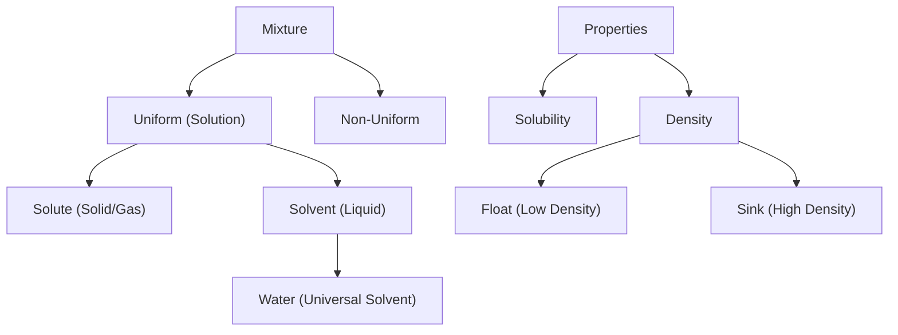

import Callout from '@/components/Callout.astro'

## Introduction

Why does salt dissolve in water but not in oil? Why does a massive ship float while a tiny stone sinks? This chapter explores the science of mixing substances and the principles of density and buoyancy.

We will learn how solutions are formed, what limits solubility, and how to measure the density of objects to predict if they will float or sink.

### Chapter Roadmap

*   **Topic 1:** [Solutions](/topics/01-solutions) (Solute, Solvent, and Types of Mixtures)
*   **Topic 2:** [Solubility](/topics/02-solubility) (Saturated solutions and Temperature effects)
*   **Topic 3:** [Density](/topics/03-density) (Mass, Volume, and Calculations)
*   **Topic 4:** [Floating and Sinking](/topics/04-floating-and-sinking) (Buoyancy and Archimedes' Principle)

### Key Definitions

| Term | Definition |
| :--- | :--- |
| **Solution** | A uniform mixture of a solute dissolved in a solvent. |
| **Solute** | The substance being dissolved (usually in smaller quantity, e.g., Salt). |
| **Solvent** | The substance doing the dissolving (usually in larger quantity, e.g., Water). |
| **Saturated Solution** | A solution in which no more solute can be dissolved at a given temperature. |
| **Density** | Mass per unit volume ($D = M/V$). |
| **Buoyancy** | The upward force exerted by a fluid on an object placed in it. |

