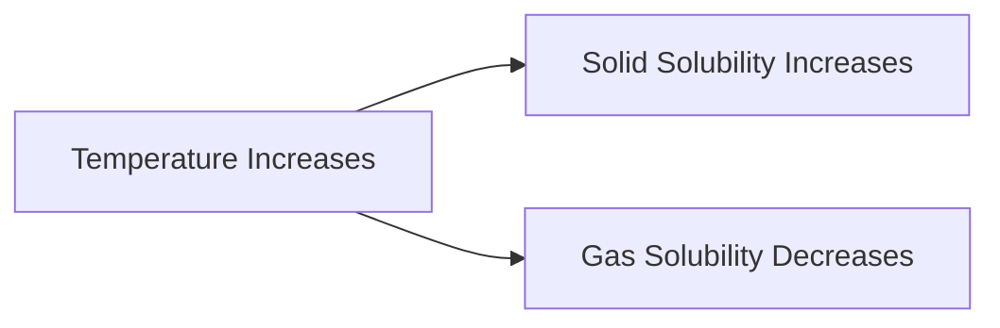

import Callout from '@/components/Callout.astro'

## Saturation

If you keep adding salt to a glass of water, eventually it stops dissolving and settles at the bottom.
*   **Saturated Solution:** A solution that cannot dissolve any more solute at that temperature.
*   **Unsaturated Solution:** A solution that can still dissolve more solute.

## Effect of Temperature

### 1. Solids in Liquids
**Rule:** Solubility of solids generally **increases** with temperature.
*   *Experiment:* If you heat a saturated solution of baking soda, the undissolved soda at the bottom will dissolve. A saturated solution becomes unsaturated upon heating.

### 2. Gases in Liquids
**Rule:** Solubility of gases generally **decreases** with temperature.
*   *Example:* Aquatic life prefers cold water because it contains more dissolved Oxygen than hot water. When you boil water, you see bubbles forming early on—this is dissolved air escaping as solubility drops.

