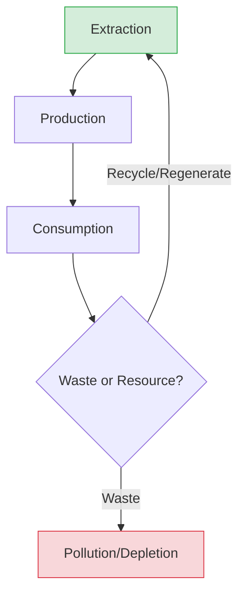

import Callout from '@/components/Callout.astro'

## Conceptual Questions

### Q1: Why is the distinction between "Stock" and "Reserve" important in resources?
*(Note: While not explicitly defined in this chapter text, this concept aids understanding "Technologically Accessible" and "Economically Feasible")*

*   **Stock:** All materials in the environment that have the potential to satisfy human needs (e.g., Hydrogen in water is a potential energy source).
*   **Reserve:** The subset of the stock that can be put into use with existing technology (e.g., Water in dams).
*   **Significance:** We must turn more stock into reserves through R&D (like making solar cells cheaper).

### Q2: Explain the term "Lokasangraha" in the context of resource management.
**Answer:**
"Lokasangraha" is a concept from the *Bhagavad Gita* mentioned in the chapter. It refers to the idea that individuals must transcend personal desires and act for the **wellbeing of all** (collective welfare).
*   In resource management, this means not hoarding or over-exploiting resources for personal profit but managing them so that the entire society and future generations benefit. It is the spiritual foundation of **Sustainability**.

### Q3: How does the "Natural Resource Curse" affect a nation's development?
**Answer:**
The "Natural Resource Curse" or "Paradox of Plenty" occurs when resource-rich countries fail to develop other sectors of their economy.
1.  **Over-reliance:** They rely only on selling raw materials (oil, coal).
2.  **Currency fluctuation:** High exports make local currency expensive, hurting other industries like manufacturing.
3.  **Neglect:** Education and innovation are often neglected.
*   **Result:** Despite having gold or oil, the general population remains poor (e.g., certain African or Latin American nations). India avoids this by using resources to build domestic industries.

### Diagram: The Sustainable Cycle
The goal of stewardship is to keep the resource loop closed.

