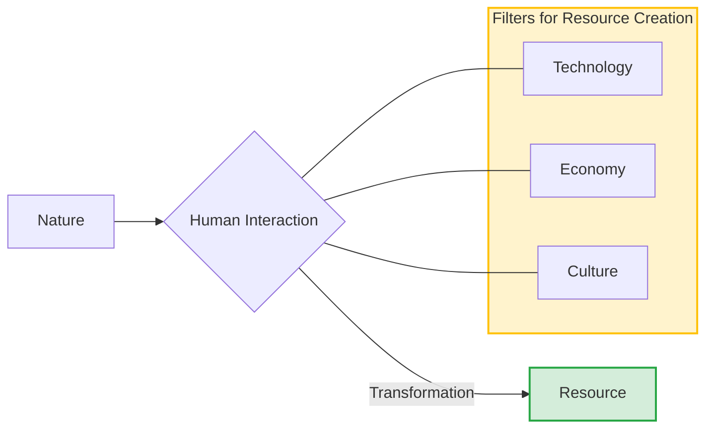

import Callout from '@/components/Callout.astro'

## When Does Nature Become a Resource?

The word **'Nature'** refers to the totality of life and non-life forms in our environment not created by humans. However, not everything in nature is automatically a "resource."

<Callout variant="tip">
**Definition:** Elements of Nature become **resources** only when humans use them for sustenance or create new things from them for utility/consumption.
</Callout>

**Example:**
*   A tree standing in a forest is part of the **environment**.
*   When we cut it to make furniture or use its fruit for food, it becomes a **resource**.

### The Three Criteria
Often, resources are not easily accessible. Petroleum might exist deep under the ocean, but without the right machinery, it is useless to us. Therefore, three criteria determine if an entity is a resource:

1.  **Technologically Accessible:** Do we have the tools and knowledge to extract or use it?
2.  **Economically Feasible:** Is the cost of extraction lower than the value of the resource?
3.  **Culturally Acceptable:** Does the extraction violate cultural or religious beliefs (e.g., sacred groves)?

### The Concept of Exploitation
Usually, "exploitation" has a negative meaning. However, in the context of natural resources, it technically refers to:
1.  **Extraction**
2.  **Utilisation**
3.  **Consumption**

The Earth has formed treasures like water, air, soil, coal, petroleum, and minerals over millions of years. Humans have learned to identify and exploit these for their benefit.
