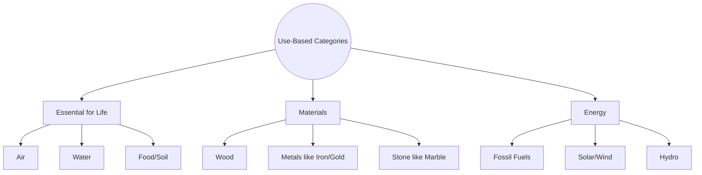

import Callout from '@/components/Callout.astro'

## Categorising Natural Resources

Categorisation helps us communicate ideas effectively. In Science, you classify things as living or non-living. Similarly, in Geography, we categorize resources based on specific criteria. One major method is **based on their use**.

### 1. Resources Essential for Life
These are resources without which biological survival is impossible. We cannot "manufacture" these; we can only take them from Nature.
*   **Air:** Taken from the atmosphere.
*   **Water:** Taken from rivers, ponds, and aquifers.
*   **Soil/Food:** Cultivation relies on soil and biological organisms.

### 2. Resources for Materials
Humans create physical objects using gifts from Nature. We transform raw materials into utilities or art.
*   **Wood:** Transformed into chairs, paper, or statues.
*   **Minerals:** Gold for jewelry, marble for construction, iron for machinery.
*   **India's Diversity:** India's vast geographical diversity provides a wide array of material resources, from timber in the northeast to marble in Rajasthan.

### 3. Resources for Energy
Energy is the cornerstone of modern civilization. It powers buildings, transportation, and industrial production.
*   **Fossil Fuels:** Coal, petroleum, natural gas.
*   **Renewables:** Sunlight, wind, flowing water.

