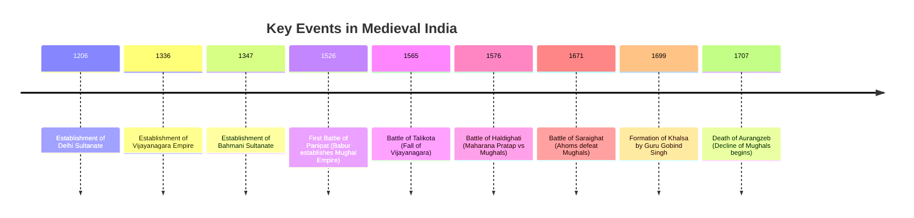

import Callout from '@/components/Callout.astro'

## Introduction

A new era in India's journey began in the early 11th century. This period, often termed the **Medieval Period** (roughly 11th to 17th centuries), witnessed unprecedented invasions from beyond the Hindu Kush mountains, reshaping the political landscape of the Subcontinent.

This chapter explores the rise and fall of major powers like the **Delhi Sultanate** and the **Mughal Empire**, the resilience of regional kingdoms like **Vijayanagara** and the **Ahoms**, and the social and economic fabric of the time.

### The Big Questions
1.  **How did foreign invasions and the rise of new dynasties reshape India’s political boundaries?**
2.  **How did Indian society respond to invasions?** (Adaptation, resistance, and cultural synthesis).
3.  **What impact did this period have on the lives of the people?** (Economy, trade, and administration).

### Historical Timeline

The following timeline highlights key events that defined this era:

<Callout variant="info">
**Note on "Medieval":** The term originally referred to European history (between the Roman Empire and the Renaissance). In the Indian context, we use it to denote the period from the **11th to the 17th centuries**, a time of great transition, conflict, and cultural flowering.
</Callout>

### Chapter Roadmap

| Topic | Description |
| :--- | :--- |
| **Delhi Sultanate** | The rule of five dynasties and early resistance. |
| **Regional Powers** | The rise of Vijayanagara and the Bahmani Sultanate in the South. |
| **The Mughals** | From Babur to Aurangzeb: Consolidation, expansion, and policy shifts. |
| **Resistance** | The struggles of the Rajputs, Ahoms, Gonds, and Sikhs. |
| **Administration** | How these vast empires were governed (Iqta, Mansabdari). |
