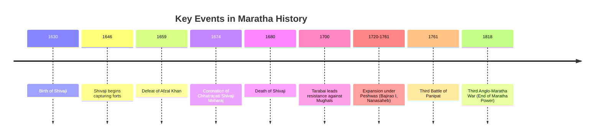
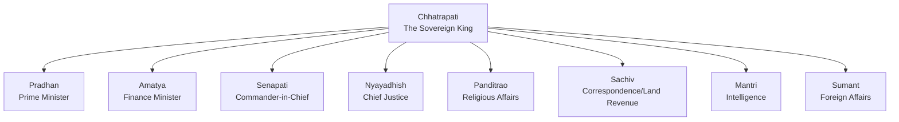

<<<FILE_START: index.mdx>>>
---
title: "The Rise of the Marathas"
description: "Explore the rise of the Maratha Empire under Chhatrapati Shivaji Maharaj, their administrative systems, military strategies, and pan-Indian expansion."
date: 2024-04-10
tags: ["history", "marathas", "shivaji", "peshwas", "grade-8"]
order: 1
draft: false
---

import Callout from '@/components/Callout.astro'

## Introduction

The rise of the Marathas in the 17th century was a defining moment in Indian history. Native to the rugged Deccan plateau, the Marathas, united by a common language (Marathi) and the Bhakti tradition, rose to challenge the Mughal Empire and eventually became the primary power in India before the British conquest.

This chapter traces the journey from the establishment of **Swarājya** (self-rule) by **Chhatrapati Shivaji Maharaj** to the empire's expansion under the Peshwas and valiant queens like **Tarabai** and **Ahilyabai Holkar**.

<Callout variant="tip">
**Historical Insight:**
"The British took India from the Marathas more than from the Mughals or any other power."
— *Historical consensus on 18th-century India*
</Callout>

### The Big Questions
1.  **Who were the Marathas?** How did they become the largest pan-Indian power?
2.  **What were the features of their governance?** (Civil, Military, and Judicial).
3.  **What impact did the Maratha Empire leave on Indian history?**

### Historical Timeline

The Maratha power rose, consolidated, and expanded over two centuries.

### Chapter Roadmap

| Topic | Description |
| :--- | :--- |
| **Rise of Shivaji** | Foundation of Swarajya, conflict with Bijapur and Mughals, and Coronation. |
| **Marathas After Shivaji** | The war of independence, rule of Peshwas, and expansion to Delhi and beyond. |
| **Administration** | The *Ashta Pradhan* council, revenue systems (*Chauth*), and judicial fairness. |
| **Military & Navy** | Guerrilla warfare (*Ganimi Kava*), the importance of forts, and the rise of a naval power. |
| **Women & Culture** | Leadership of Tarabai and Ahilyabai Holkar; Cultural revival in Thanjavur. |

<<<FILE_END>>>
<<<FILE_START: topics/01-rise-of-shivaji.mdx>>>
---
title: "Foundation and Rise of Shivaji"
description: "The early life of Shivaji Maharaj, his military campaigns, conflict with the Mughals, and coronation."
date: 2024-04-10
tags: ["shivaji", "history", "deccan", "mughals"]
order: 2
draft: false
---

import Callout from '@/components/Callout.astro'

## Who Are the Marathas?
The Marathas are a Marathi-speaking warrior group native to the Deccan plateau (present-day Maharashtra). Before their political rise, a strong cultural foundation was laid by **Bhakti Saints** like Dnyaneshwar, Namdev, Tukaram, and Ramdas, who promoted social unity and devotion.

## The Rise of Shivaji (Born 1630)
Born to **Shahji Bhonsle** and **Jijabai**, Shivaji grew up in Pune. While his father served the Deccan Sultanates, Shivaji envisioned a sovereign kingdom (*Swarājya*).
*   **At age 16:** He began capturing neglected forts in the Pune region, challenging the established Sultanates.

### Conflict with Bijapur: Afzal Khan (1659)
To crush Shivaji, the Bijapur Sultanate sent their veteran general, **Afzal Khan**.
*   **Strategy:** Shivaji engaged in psychological warfare and agreed to a private meeting at the foot of **Pratapgad Fort**.
*   **The Encounter:** Anticipating treachery, Shivaji wore armor under his clothes and concealed a **Wāgh nakh** (tiger-claw weapon). When Afzal Khan attacked, Shivaji killed him.
*   **Result:** The Maratha army, hidden in the dense forests, routed the leaderless Bijapur forces using guerrilla tactics.

### Conflict with the Mughals
Shivaji's growing power alarmed the Mughal Emperor Aurangzeb.

#### 1. Shaista Khan and the "Surgical Strike"
*   Mughal noble Shaista Khan occupied Pune.
*   **The Raid:** Shivaji infiltrated the camp at night with a small band of soldiers, entering the Lal Mahal. Shaista Khan barely escaped, losing his fingers. This daring raid forced the Mughals to retreat.

#### 2. The Sack of Surat
*   Surat was a wealthy Mughal trading port. Shivaji sacked it twice to obtain funds for his army, challenging Mughal prestige.

#### 3. Treaty of Purandar & Agra Escape
*   Aurangzeb sent **Jai Singh** (a Rajput general) to defeat Shivaji.
*   **Treaty:** Shivaji was forced to sign the Treaty of Purandar, surrendering many forts.
*   **Agra Visit (1666):** Shivaji visited Aurangzeb’s court but was insulted and placed under house arrest.
*   **The Great Escape:** Shivaji famously escaped by hiding in baskets of sweets meant for distribution to holy men.

### Coronation (1674)
Shivaji was crowned **Chhatrapati** (Sovereign King) at **Raigad Fort** in 1674.
*   He adopted the title *Kshatriya Kulavantas*.
*   Started a new era: *Rājyābhiṣheka shaka*.
*   **Dakshin Digvijaya:** He later expanded his kingdom into South India (Tamil Nadu/Karnataka), creating a strategic depth against Mughals.

<Callout variant="info">
**Key Tactic:** Shivaji mastered **Guerrilla Warfare** (*Ganimi Kava*), utilizing the rugged terrain of the Sahyadris to ambush larger enemy armies with speed and surprise.
</Callout>

<<<FILE_END>>>
<<<FILE_START: topics/02-marathas-after-shivaji.mdx>>>
---
title: "The Marathas After Shivaji"
description: "The struggle for survival, the rise of the Peshwas, and pan-Indian expansion."
date: 2024-04-10
tags: ["peshwa", "panipat", "expansion", "empire"]
order: 3
draft: false
---

import Callout from '@/components/Callout.astro'

## The War of Independence (1680–1707)
After Shivaji’s death in 1680, the Marathas faced the full might of Aurangzeb.
1.  **Chhatrapati Sambhaji:** Fought bravely but was captured, tortured, and executed by Aurangzeb.
2.  **Chhatrapati Rajaram:** Fled to **Gingee** (Tamil Nadu) to continue the fight from the south.
3.  **Maharani Tarabai:** After Rajaram's death, his widow Tarabai led the resistance. She organized counter-invasions into Mughal territory (Malwa/Gujarat).

**Result:** Aurangzeb spent 25 years in the Deccan trying to crush the Marathas but failed. He died in 1707, leaving a bankrupt and fractured Mughal empire.

## The Era of the Peshwas
Under Chhatrapati Shahu (Sambhaji's son), the administrative power shifted to the **Peshwas** (Prime Ministers), based in Pune.
*   **Key Peshwas:** Balaji Vishwanath, **Bajirao I**, and Nanasaheb.
*   **Structure:** The empire became a confederacy. Regional chiefs (Gaekwads, Holkars, Scindias, Bhonsles) ruled semi-autonomously but acknowledged the Peshwa's authority.

### Pan-Indian Expansion
*   **North:** Controlled Delhi, Lahore, and Peshawar (modern Pakistan).
*   **East/South:** Expanded into Odisha, Bengal, and Karnataka.
*   **Role:** They became the protectors of the Mughal throne, often dictating politics in Delhi.

### The Third Battle of Panipat (1761)
*   **Conflict:** Marathas vs. **Ahmad Shah Abdali** (Afghan ruler).
*   **Outcome:** A disastrous defeat for the Marathas. A generation of leaders was lost.
*   **Recovery:** Under Peshwa Madhavrao and generals like **Mahadji Shinde**, the Marathas quickly recovered and recaptured Delhi in 1771.

### The End of Maratha Power
The British identified the Marathas as their main rivals.
*   **Anglo-Maratha Wars:** Three wars were fought between 1775 and 1818.
*   **Causes of Defeat:** Internal disunity among Maratha chiefs and superior British organization/technology.
*   **1818:** The Peshwa rule ended, and the British took control of India.

<<<FILE_END>>>
<<<FILE_START: topics/03-administration.mdx>>>
---
title: "Maratha Administration"
description: "Civil, judicial, and revenue administration under the Marathas."
date: 2024-04-10
tags: ["administration", "ashta-pradhan", "chauth", "governance"]
order: 4
draft: false
---

import Callout from '@/components/Callout.astro'

## Ashta Pradhan Mandal
Shivaji established a council of eight ministers to assist in governance.

### Key Administrative Reforms
1.  **Abolition of Jagirs:** Unlike Mughals, Shivaji preferred paying officials in **cash** rather than land grants (*Jagirs*) to prevent them from becoming too powerful independent warlords.
2.  **Transfers:** Officials were frequently transferred to prevent entrenched power.
3.  **Welfare:** Strict instructions were given not to harass the peasantry.
    > *"If you cut mango or jackfruit trees, will the people's sorrow ever end? Do not use force."* — Shivaji's letter to officials.

## Revenue System
*   **Taxes:**
    *   **Chauth:** 25% of the revenue collected from territories *not* directly under Maratha rule, in exchange for protection from raids.
    *   **Sardeshmukhi:** An additional 10% levy claimed by the Chhatrapati as the head Deshmukh.
*   **Agriculture:** Loans were provided to farmers; measurement of land was standardized.

## Judicial System
*   **Panchayat:** The main body for delivering justice at the local level.
*   **Appeals:** Could be made to the King or Chief Justice.
*   **Nature:** Capital punishment (death penalty) was rare; the system was noted for moderation.
*   **Police:** In towns, the **Kotwal** maintained law and order.

<<<FILE_END>>>
<<<FILE_START: topics/04-military-and-navy.mdx>>>
---
title: "Military Strategy and Navy"
description: "The role of forts, guerrilla warfare, and the establishment of a Blue Water Navy."
date: 2024-04-10
tags: ["military", "forts", "navy", "kanhoji-angre"]
order: 5
draft: false
---

import Callout from '@/components/Callout.astro'

## Forts: The Core of the State
Forts (*Killa*) were the backbone of Maratha power.
*   **Ramachandrapant Amatya** wrote: *"This kingdom was created by the late great master from forts alone."*
*   **Strategy:** Forts provided shelter during invasions, storage for supplies, and control over trade routes.
*   **Famous Forts:** Raigad (Capital), Pratapgad, Sindhudurg (Sea Fort), Gingee.

## Army Structure
The army consisted of Infantry and Cavalry.
1.  **Bargirs:** Soldiers whose horses and weapons were provided by the State.
2.  **Shiledars:** Freelance soldiers who brought their own horses and equipment.

### Guerrilla Warfare (*Ganimi Kava*)
*   **Concept:** Using small, mobile units to ambush large, slow-moving armies.
*   **Tactics:** Surprise attacks, cutting off supply lines, and retreating into difficult terrain (hills/forests) where enemy cavalry could not follow.

## Maritime Supremacy (The Navy)
Shivaji realized that "He who has the Navy, owns the Sea." He was one of the few Indian rulers to build a dedicated navy to counter the Portuguese, British, and Siddis.

*   **Key Admiral:** **Kanhoji Angre** (18th Century).
    *   Labeled a "pirate" by frustrated Europeans.
    *   He effectively controlled the Konkan coast, forcing Europeans to buy permits (*Cartaz*) to trade, reversing the practice where Europeans forced Indians to buy passes.
*   **Ships:** Built small, maneuverable ships (Gurabs, Gallivats) suited for the shallow creeks of the Konkan coast, which could outmaneuver heavy European vessels.

<<<FILE_END>>>
<<<FILE_START: topics/05-women-leaders-culture.mdx>>>
---
title: "Women Leaders and Cultural Legacy"
description: "The contributions of Maratha women like Tarabai and Ahilyabai, and the cultural revival in Thanjavur."
date: 2024-04-10
tags: ["culture", "women-rulers", "ahilyabai", "thanjavur"]
order: 6
draft: false
---

import Callout from '@/components/Callout.astro'

## Mighty Maratha Women

### Maharani Tarabai
*   **Role:** Led the Maratha resistance after her husband Rajaram's death.
*   **Strategy:** She realized North India was empty of Mughal troops (since Aurangzeb was in the Deccan). She sent Maratha armies north to raid Mughal lands, turning the tide of the war.

### Ahilyabai Holkar (1725–1795)
*   **Ruler of Indore:** Governed for 30 years after losing her husband and son.
*   **Administration:** Known for justice, stability, and promoting the weaving industry (Maheshwari sarees).
*   **Builder:** She rebuilt temples across India that had been destroyed, including **Kashi Vishwanath (Varanasi)** and **Somnath (Gujarat)**. She built ghats, wells, and rest houses from the Himalayas to Rameswaram.

## Cultural Revival

### Language and Identity
*   **Rajya-Vyavahara-Kosha:** Shivaji commissioned this dictionary to replace Persian administrative terms with Sanskrit/Marathi equivalents.
*   **Seal:** His royal seal was in Sanskrit, asserting a native Hindu identity.

### Thanjavur Marathas (Tamil Nadu)
The branch of Marathas ruling Thanjavur fostered a brilliant syncretic culture.
*   **Serfoji II:**
    *   A scholar-king interested in Medicine (established *Dhanvantari Mahal*).
    *   Patronized Western and Indian medicine.
    *   Installed the first printing press by a native ruler.
    *   **Arts:** Contributed to the development of **Carnatic Music** and **Bharatanatyam**.

<Callout variant="tip">
**Legacy:** The Maratha Empire proved that a powerful pan-Indian empire could be run by indigenous rulers, planting the early seeds of the idea that Indians could govern themselves.
</Callout>

<<<FILE_END>>>
<<<FILE_START: solutions/ex-3.1.mdx>>>
---
title: "Chapter Exercises Solution"
description: "Detailed answers to the Questions and Activities from Chapter 3."
date: 2024-04-10
tags: ["solutions", "exercises", "grade-8"]
order: 7
draft: false
---

import Callout from '@/components/Callout.astro'

## Questions and Activities

### 1. Analyse how geography (particularly mountains and coastlines) guided Maratha military strategy and state formation.

**Answer:**
Geography was the greatest ally of the Marathas.
*   **Mountains (Sahyadris):** The steep hills and dense forests were perfect for **Guerrilla Warfare**. Shivaji built forts on high peaks (like Raigad and Pratapgad) which were difficult for heavy Mughal artillery and cavalry to access. They served as watchtowers and safe havens.
*   **Coastline (Konkan):** Shivaji realized the threat posed by European powers arriving by sea. The long Konkan coastline necessitated a **Navy**. He built sea forts like **Sindhudurg** to protect trade and check the influence of the Siddi and Portuguese naval powers.

### 2. Imagine you are creating a short biography of a Maratha leader. Choose one (e.g., Ahilyabai Holkar).

**Answer: Ahilyabai Holkar**
Ahilyabai Holkar (1725–1795) was the noble queen of the Malwa kingdom (Indore). Thrust into power after the death of her husband and father-in-law, she ruled for three decades with wisdom and compassion.
*   **Challenge Overcome:** In an era dominated by men, she not only held onto power but also maintained peace and stability while the rest of India was in chaos. She personally led armies into battle when necessary.
*   **Inspiration:** She is best known for her piety and infrastructure work. She rebuilt the Kashi Vishwanath temple (destroyed by Aurangzeb) and established the Maheshwar weaving industry, providing livelihoods to her people. She represents the ideal of a benevolent ruler (*Lokmata*).

### 3. If you could visit one Maratha fort today, which would you choose and why?

**Answer:**
I would choose **Raigad Fort**.
*   **Strategic Importance:** It was the capital of the Maratha Empire chosen by Shivaji himself. It is situated on a steep hill, making it almost impregnable.
*   **History:** This is where Shivaji’s **Coronation (Rajyabhishek)** took place in 1674, marking the formal birth of the Maratha Empire.
*   **Architecture:** It has the *Maha Darwaja*, the marketplace (*Holicha Mal*), and the ruins of the royal palace, offering a glimpse into the grandeur of Swarajya.

### 4. "The British took India from the Marathas more than from the Mughals." Explain.

**Answer:**
By the mid-18th century, the Mughal Empire had declined and was confined to Delhi. The **Marathas** controlled vast territories across North, Central, and South India (including Delhi, Lahore, and Cuttack). They were the *de facto* protectors of the Mughal throne.
*   **Evidence:** The British had to fight **three major Anglo-Maratha wars** (1775–1818) to establish supremacy. Defeating the Marathas was the final hurdle for the British East India Company to become the masters of India.

### 5. Compare how Shivaji and later Marathas treated religious places and people of different faiths.

**Answer:**
*   **Shivaji:** He was a devout Hindu but secular in statecraft. He respected Muslim saints, forbade the destruction of mosques, and treated women of captured enemy camps with honor. His navy and army had many Muslim commanders (e.g., Daulat Khan).
*   **Thanjavur Marathas:** They built a syncretic culture. Serfoji II patronized arts and sciences irrespective of religion, including Western medicine and Christian missionaries (Schwartz).
*   **Later Period:** While generally tolerant, occasional excesses occurred during expansion (e.g., raids in Bengal), but these were political/economic rather than religiously motivated.

### 6. Why were forts 'the core of the state' for Marathas?

**Answer:**
As stated by Ramachandrapant Amatya in *Adnyapatra*:
1.  **Defense:** In the absence of forts, land gets devastated by invasion. Forts allowed the army to hold out against much larger forces (like Aurangzeb's).
2.  **Control:** They dominated trade routes and mountain passes.
3.  **Survival:** During the 27-year war with Aurangzeb, the Marathas survived by moving from one fort to another, preventing the Mughals from ever capturing the leadership decisively.

### 7. Design a Maratha Coin.

**Answer:**
*   **Front:** Image of a **Fort** (symbolizing strength) and a **Ship** (symbolizing naval power).
*   **Back:** Inscription in **Devanagari** (asserting linguistic identity) and a **Wheat Sheaf** (symbolizing agricultural prosperity).
*   **Metal:** Copper or Gold, following the *Shivrai* and *Hon* denominations used by Shivaji.

### 8. What was the Marathas' most important contribution to Indian history?

**Answer:**
The most important contribution was the **revival of indigenous sovereignty (Swarajya)**. At a time when India was dominated by foreign powers (Mughals, Europeans), the Marathas demonstrated that Indians could build a powerful, sophisticated empire, administer it efficiently (Ashta Pradhan), and defend it. They broke the myth of Mughal invincibility and preserved Indian culture, temples, and traditions during a critical transitional century.

<<<FILE_END>>>
<<<FILE_START: practice/activity-solutions.mdx>>>
---
title: "Let's Explore & Think About It"
description: "Solutions to in-text prompts and critical thinking questions."
date: 2024-04-10
tags: ["practice", "activities", "critical-thinking"]
order: 8
draft: false
---

import Callout from '@/components/Callout.astro'

## In-Text Activity Solutions

### Page 63: Bhakti Movement
**Prompt:** Choose a Bhakti saint and learn about them.
**Answer:**
*   **Saint:** Sant Tukaram.
*   **Region:** Maharashtra (17th Century).
*   **Teaching:** He preached equality and devotion to Lord Vitthal. He criticized caste discrimination and empty rituals.
*   **Connection:** Shivaji Maharaj often attended his *Kirtans*. His poetry (*Abhangas*) inspired the common people to unite, providing the moral foundation for the Maratha state.

### Page 65: Three Questions for Shivaji
**Prompt:** If you met Shivaji, what would you ask?
**Answer:**
1.  *Strategy:* How did you develop the concept of a Navy when no other Indian ruler saw its importance?
2.  *Leadership:* How did you inspire loyalty in your soldiers to the point they were ready to die for you (like Baji Prabhu Deshpande)?
3.  *Vision:* What was your ultimate vision for India beyond the Deccan?

### Page 66: Guerrilla Warfare in Other Countries
**Prompt:** Which other countries adopted this method?
**Answer:**
*   **Vietnam:** The Viet Cong used guerrilla tactics (tunnels, jungle ambushes) to defeat the technologically superior US Army.
*   **Spain:** The term *Guerrilla* (Little War) originated during the Peninsular War against Napoleon.
*   **Geography:** All these regions (Vietnam jungles, Spanish mountains, Sahyadri hills) offered natural cover that negated the enemy's firepower.

### Page 73: Shivaji's Letter on Trees
**Prompt:** What values does the letter show?
**Answer:**
1.  **Environmental Stewardship:** He viewed trees as valuable resources, not just lumber.
2.  **Empathy:** He compared trees to children, understanding the emotional and economic loss to the peasant if a tree is cut.
3.  **Justice:** He strictly forbade oppression of his own subjects for military needs.

### Page 80: Connection between Marathas and Bharatnatyam
**Prompt:** Find the connection.
**Answer:**
The **Thanjavur Maratha** rulers (specifically Serfoji II and his ancestors) were great patrons of the arts. The famous **Thanjavur Quartet** (four brothers who codified the modern repertoire of Bharatanatyam) flourished in the Maratha court of Thanjavur. The dance form evolved significantly under their patronage, blending local Tamil traditions with the court's support.

<<<FILE_END>>>
<<<FILE_START: practice/map-work.mdx>>>
---
title: "Map Work Analysis"
description: "Analysis of the Maratha Empire's expansion."
date: 2024-04-10
tags: ["map", "geography", "history"]
order: 9
draft: false
---

import Callout from '@/components/Callout.astro'

## Map Analysis

### Fig 3.9: Shivaji's Kingdom (1680)
*   **Core:** A narrow strip along the Sahyadris and Konkan coast (Pune, Raigad, Satara).
*   **South:** Detached territories in Tamil Nadu (Gingee, Thanjavur) and Karnataka.
*   **Strategy:** This "Southern Extension" was deliberate. When Aurangzeb captured the core Maharashtra forts later, the Maratha leadership shifted to Gingee in the south, stretching Mughal supply lines until they broke.

### Fig 3.11: Maratha Empire (1759)
*   **Extent:** From the Indus river (Attock/Peshawar) in the North to the Tungabhadra in the South. From Gujarat in the West to Odisha in the East.
*   **Color Coding:**
    *   **Orange:** Direct Maratha rule or Tributary states.
    *   **Green (Nizam):** Confined to Hyderabad.
    *   **Yellow (Mysore):** Confined to the south.
*   **Significance:** This map proves the Marathas were the true pan-Indian successors to the Mughals. The British had to conquer *this* map, not the Mughal map, to rule India.

<<<FILE_END>>>
