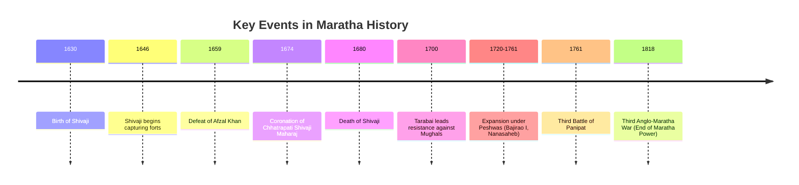

import Callout from '@/components/Callout.astro'

## Introduction

The rise of the Marathas in the 17th century was a defining moment in Indian history. Native to the rugged Deccan plateau, the Marathas, united by a common language (Marathi) and the Bhakti tradition, rose to challenge the Mughal Empire and eventually became the primary power in India before the British conquest.

This chapter traces the journey from the establishment of **Swarājya** (self-rule) by **Chhatrapati Shivaji Maharaj** to the empire's expansion under the Peshwas and valiant queens like **Tarabai** and **Ahilyabai Holkar**.

<Callout variant="tip">
**Historical Insight:**
"The British took India from the Marathas more than from the Mughals or any other power."
— *Historical consensus on 18th-century India*
</Callout>

### The Big Questions
1.  **Who were the Marathas?** How did they become the largest pan-Indian power?
2.  **What were the features of their governance?** (Civil, Military, and Judicial).
3.  **What impact did the Maratha Empire leave on Indian history?**

### Historical Timeline

The Maratha power rose, consolidated, and expanded over two centuries.

### Chapter Roadmap

| Topic | Description |
| :--- | :--- |
| **Rise of Shivaji** | Foundation of Swarajya, conflict with Bijapur and Mughals, and Coronation. |
| **Marathas After Shivaji** | The war of independence, rule of Peshwas, and expansion to Delhi and beyond. |
| **Administration** | The *Ashta Pradhan* council, revenue systems (*Chauth*), and judicial fairness. |
| **Military & Navy** | Guerrilla warfare (*Ganimi Kava*), the importance of forts, and the rise of a naval power. |
| **Women & Culture** | Leadership of Tarabai and Ahilyabai Holkar; Cultural revival in Thanjavur. |
