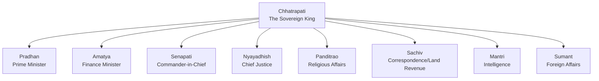

import Callout from '@/components/Callout.astro'

## Ashta Pradhan Mandal
Shivaji established a council of eight ministers to assist in governance.

### Key Administrative Reforms
1.  **Abolition of Jagirs:** Unlike Mughals, Shivaji preferred paying officials in **cash** rather than land grants (*Jagirs*) to prevent them from becoming too powerful independent warlords.
2.  **Transfers:** Officials were frequently transferred to prevent entrenched power.
3.  **Welfare:** Strict instructions were given not to harass the peasantry.
    > *"If you cut mango or jackfruit trees, will the people's sorrow ever end? Do not use force."* — Shivaji's letter to officials.

## Revenue System
*   **Taxes:**
    *   **Chauth:** 25% of the revenue collected from territories *not* directly under Maratha rule, in exchange for protection from raids.
    *   **Sardeshmukhi:** An additional 10% levy claimed by the Chhatrapati as the head Deshmukh.
*   **Agriculture:** Loans were provided to farmers; measurement of land was standardized.

## Judicial System
*   **Panchayat:** The main body for delivering justice at the local level.
*   **Appeals:** Could be made to the King or Chief Justice.
*   **Nature:** Capital punishment (death penalty) was rare; the system was noted for moderation.
*   **Police:** In towns, the **Kotwal** maintained law and order.
