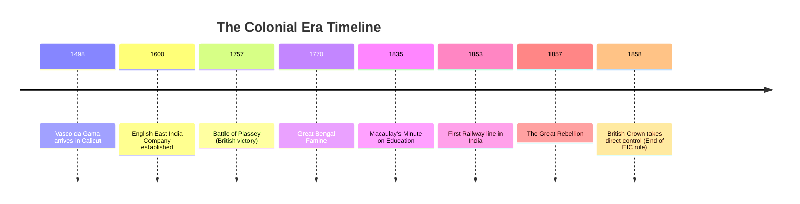

import Callout from '@/components/Callout.astro'

## Introduction

The Colonial Era marks a transformative and often traumatic period in Indian history. It explains how European powers, particularly the British, transformed from traders seeking spices into imperial rulers controlling the entire subcontinent. This chapter explores the methods of conquest, the economic devastation caused by policies like the "Drain of Wealth," and the resilient spirit of Indians who resisted foreign rule.

<Callout variant="tip">
**Quote to Ponder:**
"Modern England has been made great by Indian wealth, ... wealth always taken by the might and skill of the stronger."
— *William Digby (1901)*
</Callout>

### The Big Questions
1.  **What is colonialism?**
2.  **What drew European powers to India?**
3.  **What was India’s economic standing before and during the colonial period?**
4.  **How did the British colonial domination impact the country?**

### Historical Timeline

The following timeline tracks the shift from trade to dominion:

### Chapter Roadmap

| Topic | Description |
| :--- | :--- |
| **The Age of Colonialism** | Understanding the arrival of Portuguese, Dutch, and French powers. |
| **British Conquest** | How the EIC used "Divide and Rule," Subsidiary Alliances, and the Doctrine of Lapse. |
| **Economic Impact** | The destruction of Indian industries, the "Drain of Wealth," and devastating famines. |
| **Social Changes** | The imposition of English education and the dismantling of village governance. |
| **Resistance** | From tribal uprisings (Santhals) to the Great Rebellion of 1857. |
