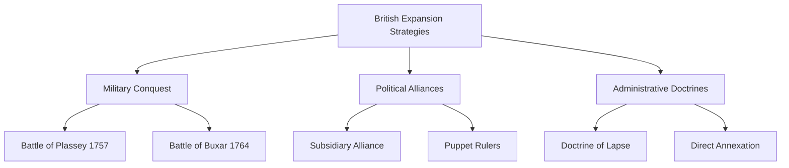

import Callout from '@/components/Callout.astro'

## From Traders to Rulers
The **English East India Company (EIC)** began as a trading body with a royal charter. Unlike varied conquests, the British takeover was gradual, calculated, and often disguised as commercial enterprise.

### 1. Divide and Rule
The British exploited rivalries between regional rulers and religious communities.
*   **Battle of Plassey (1757):** The turning point.
    *   **Robert Clive** conspired with **Mir Jafar** (the commander of Nawab Siraj-ud-daulah).
    *   Mir Jafar's forces stood aside, ensuring a British victory. This victory gave the British control over Bengal's vast resources.

### 2. Subsidiary Alliance
A political trap devised to control Indian states without the cost of direct administration.
*   **Terms:**
    1.  Indian rulers had to maintain British troops at their own expense.
    2.  A British **Resident** was stationed in the court.
    3.  Rulers could not conduct foreign relations without British permission.
*   **Result:** Rulers lost sovereignty and money ("Empire on the cheap"). **Hyderabad** was the first to sign in 1798.

### 3. Doctrine of Lapse
Introduced by Lord Dalhousie in the mid-19th century.
*   **The Rule:** If a ruler of a princely state died without a *natural male heir*, the state would be annexed by the British.
*   **Impact:** Disregarded the Hindu tradition of adoption. Led to the annexation of **Satara, Jhansi, Nagpur**, and others, fueling resentment that led to the 1857 rebellion.

