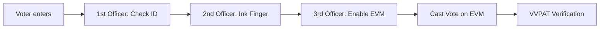

import Callout from '@/components/Callout.astro'

## Short Answer Questions

### Q1: What is a "Constituency"?
**Answer:** A constituency is a specific geographic area. All eligible voters living in this area elect one representative to a legislative body (like the Lok Sabha or State Assembly).

### Q2: What happens if a party violates the Model Code of Conduct?
**Answer:** The Election Commission can issue warnings, ban candidates from campaigning for a period, or even file criminal cases depending on the severity of the violation (e.g., hate speech, bribery).

### Q3: Who was the first voter of Independent India?
**Answer:** **Shyam Saran Negi** from Himachal Pradesh. He cast the first vote in the 1951 general elections and voted in every election until his death at age 105 in 2022.

### Q4: Can a person vote if they are not in their home constituency on election day?
**Answer:** Generally, no. You must vote at your assigned polling booth. However, service voters (army/police) can use **Postal Ballots**. The ECI is also exploring **Remote Voting** technologies for migrants.

## Diagram Analysis

**Identify the Official:**
*   **Checks ID Proof:** 1st Polling Officer.
*   **Inks Finger:** 2nd Polling Officer.
*   **Enables EVM:** 3rd Polling Officer.

