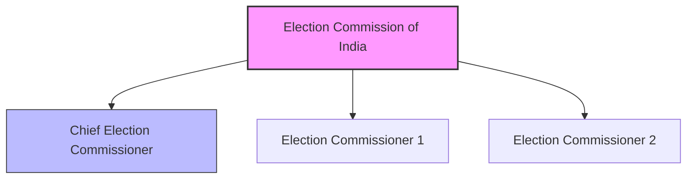

import Callout from '@/components/Callout.astro'

## What is the ECI?

The **Election Commission of India (ECI)** is an independent constitutional body responsible for administering election processes in India. Established in **1950**, it ensures elections are free, fair, and transparent.

### Structure of the ECI

**Hierarchy at Different Levels:**
*   **National Level:** Chief Election Commissioner & Election Commissioners.
*   **State Level:** Chief Electoral Officer.
*   **District Level:** District Election Officer.
*   **Constituency Level:** Returning Officer (RO).

### Key Functions
1.  **Conducting Elections:** For Lok Sabha, Rajya Sabha, State Legislative Assemblies, President, and Vice President.
2.  **Scheduling:** Deciding election dates and schedules.
3.  **Voter Registration:** Preparing and updating electoral rolls.
4.  **Model Code of Conduct:** Enforcing rules for political parties and candidates to ensure a level playing field.
5.  **Party Registration:** Registering political parties and assigning symbols.

<Callout variant="tip">
**T.N. Seshan:** A legendary Chief Election Commissioner (1990–1996) known for strict enforcement of election rules, introduction of Voter ID cards, and curbing electoral malpractice.
</Callout>

### Model Code of Conduct (MCC)
The MCC is a set of guidelines issued by the ECI to regulate political parties and candidates prior to elections.
*   **No Misuse of Power:** The ruling party cannot use government machinery (vehicles, officials) for campaigning.
*   **No New Schemes:** No new projects can be announced once elections are declared.
*   **Communal Harmony:** No soliciting votes based on caste or religion.
