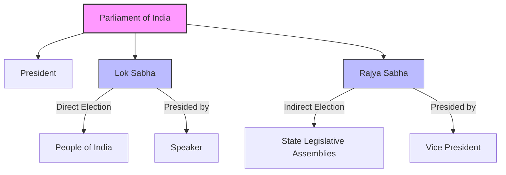

import Callout from '@/components/Callout.astro'

## The Bicameral System

The Indian Parliament is **bicameral**, meaning it consists of two houses. The structure is composed of:
1.  **The President**
2.  **The Lok Sabha** (House of the People / Lower House)
3.  **The Rajya Sabha** (Council of States / Upper House)

This system was adopted to meet the challenges of a vast and diverse country like India, ensuring both direct representation of the people and representation of the federal units (States).

### 1. The Lok Sabha (House of the People)
*   **Election:** Members are chosen through direct election by the people of India based on universal adult suffrage.
*   **Maximum Strength:** The Constitution envisages a maximum of 550 members.
*   **Representation:** Seats are allocated to states based on their population.
*   **Presiding Officer:** The **Speaker**, elected by the members, conducts sessions and maintains discipline.

### 2. The Rajya Sabha (Council of States)
*   **Election:** Members of Parliament (MPs) are elected indirectly by the electoral college (elected members of State Legislative Assemblies).
*   **Role:** It represents the interests of the States in the federal system.
*   **Presiding Officer:** The **Vice President of India** acts as the ex-officio Chairperson.

<Callout variant="info">
**Why Bicameral?**
Extensive discussions occurred during the drafting of the Constitution. It was decided that a single directly elected house might be inadequate. A second chamber (Rajya Sabha) allows for a review of legislation and represents the federal character of India (States' interests).
</Callout>

### Structure Overview

## The Sengol
In the new Lok Sabha, the **Sengol**, a gold-plated silver sceptre, is placed near the Speaker's chair.
*   **Symbolism:** It represents righteous and just rule.
*   **History:** Originally handed to Pt. Jawaharlal Nehru on August 14, 1947, to mark the transfer of power from the British. It dates back to Chola traditions where it symbolized that power must be guided by *dharma*.

## Language in Parliament
To make discussions accessible, simultaneous interpretation is available in many languages including Hindi, English, Assamese, Bengali, Gujarati, Kannada, Malayalam, Marathi, Odia, Tamil, Punjabi, Telugu, and recently Bodo, Dogri, Maithili, Manipuri, Urdu, and Sanskrit.