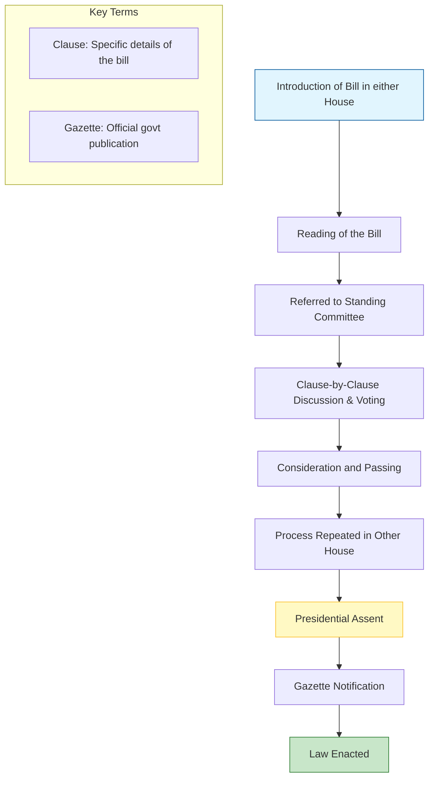

import Callout from '@/components/Callout.astro'

## Key Functions

The functions of the Parliament can be broadly classified into four heads:
1.  **Constitutional Functions:** Upholding core values like democracy, federalism, separation of powers, and Fundamental Rights.
2.  **Lawmaking:** Drafting and passing laws.
3.  **Executive Accountability:** Checking the government's actions.
4.  **Financial Accountability:** Approving the budget.

## 1. Lawmaking Process (From Bill to Act)
A primary responsibility is making laws. A law starts as a **Bill** (a draft proposal).

<Callout variant="tip">
**Example: The RTE Act**
The Right of Children to Free and Compulsory Education Act (RTE), 2009, started as an idea rooted in the Directive Principles.
1.  **2002:** 86th Amendment made education a Fundamental Right (Article 21A).
2.  **2008:** Bill tabled in Rajya Sabha.
3.  **Committee Review:** Studied and modified.
4.  **2009:** Passed by Lok Sabha and received Presidential assent.
</Callout>

### The Journey of a Bill

## 2. Executive Accountability
The Executive (PM and Ministers) acts on behalf of the Parliament and is answerable to it.
*   **Question Hour:** Typically the first hour of a session. MPs ask ministers questions about policies and activities. This forces the Executive to justify its actions.
*   **Committees:** Special committees hold meetings where ministries explain their policies.

## 3. Financial Accountability
The Parliament controls the purse strings of the nation.
*   **Budget:** The government must present an annual budget for approval.
*   **Expenditure:** Parliament monitors how funds are distributed and spent by different ministries.

<Callout variant="warning">
**Money Bill**
A Money Bill (concerned with taxation, borrowing, etc.) can **only** be introduced in the **Lok Sabha** and requires the prior recommendation of the President.
</Callout>