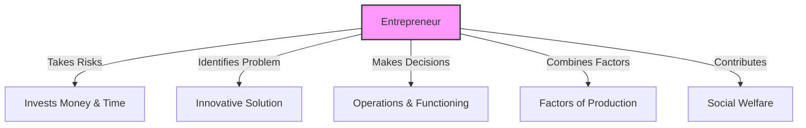

import Callout from '@/components/Callout.astro'

## 3. Capital
Capital includes both monetary resources and durable assets used for production.
*   **Physical Capital:** Machinery, tools, buildings, computers, vehicles.
*   **Financial Capital:** Money required for day-to-day operations.

### Sources of Capital
Where do businesses get money?
1.  **Personal Savings:** Family and friends (often for small businesses).
2.  **Loans:** Borrowed from banks. The borrower pays **Interest** (a fee for using the money).
3.  **Stock Market:** Large companies raise money from the public by selling shares. They pay **Dividends** (a share of profits) to shareholders.

## 4. Entrepreneurship
An entrepreneur is the person who "puts it all together".
*   **Role:** They come up with an idea, take risks, gather Land, Labour, and Capital, and solve a problem.
*   **Startup:** An entrepreneurial venture with limited resources aiming for rapid growth using technology.

### Functions of an Entrepreneur

<Callout variant="success">
**Profile: J.R.D. Tata**
A visionary entrepreneur who built modern India.
*   Started **Tata Airlines** (later Air India) in 1932.
*   Expanded into steel, cars, power, and chemicals.
*   Known for ethical business and caring for workers.
*   Awarded the **Bharat Ratna** in 1992.
</Callout>